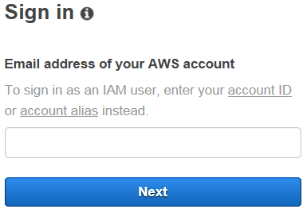
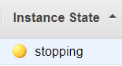
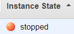
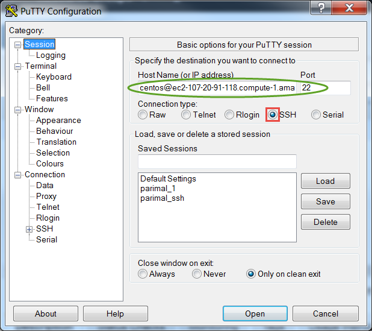

# Connecting to AWS

## Introduction

This lab guides you through the steps involved in connecting to an AWS EC2 F1 instance, and starting and stopping the instance.

## Objectives

After completing this lab, you will be able to:

- Connect to an AWS EC2 F1 instance using the provided credentials
- Start an instance
- Start a RDP (Remote Desktop Protocol) session
- Close the RDP session
- Stop the instance

## Steps
Each registered participant has been allocated a pre-configured EC2 F1 instance and should have received an email with the following details:  

- Account ID, 
- IAM username, 
- Link to access a preconfigured EC2 F1 instance

### Login into the AWS and starting an F1 instance

1. Start a web browser session
1. Either click on the provided link to open up an AWS login page OR enter [https://console.aws.amazon.com/ec2](https://console.aws.amazon.com/ec2) to open a login page  
    If you had used the link then you should see a login page similar to shown here:
    <p align="center">
    
    </p>
    <p align = "center">
    <i>Login page accessed through the provided link</i>
    </p>  
    If you had not used the link you may be directed to the AWS standard login page
    <p align="center">
    
    </p>
    <p align = "center">
    <i>Entering credentials manually</i>
    </p>  
    Enter xilinx-aws-f1-developer-labs in the Email address field and click Next to see the login page similar to shown in figure titled: Login page accessed through the provided link
1. Enter _userxx_ in the **IAM user name** field and enter the provided password in the **Password** field
1. Click **Sign In**
1. In the top right corner, using the drop-down button, select a region with F1 instances, such as **N. Virginia (US East)** or instructor indicated region
    <p align="center">
    
    </p>
    <p align = "center">
    <i>Selecting a region</i>
    </p>  
    If you select different region other then where the accounts are created for then you may not see your instance as well as the source files which are pre-loaded for the workshop.
1. Click on the **EC2** link on the dashboard or if not visible, then click on the _Services_ drop-down button and then click on **EC2**
    <p align="center">
    
    
    </p>
    <p align = "center">
    <i>Accessing EC2 service</i>
    </p>  
1. Click on the **Instances** link on the left panel
    <p align="center">
    
    </p>
    <p align = "center">
    <i>Accessing Instances</i>
    </p>  
    You may see several instances
1. Enter your username in the filter field just below the **Launch Instance** button and hit enter
    <p align="center">
    
    </p>
    <p align = "center">
    <i>Filtering your instance</i>
    </p>  
1. Making sure that your instance is selected, click on the **Actions &gt; Instance State &gt; Start**
    <p align="center">
    
    </p>
    <p align = "center">
    <i>Starting an instance</i>
    </p>  
1. Click on the **Yes, Start** button
1. Click on the refresh button() to see the updated status to _Running_
    <p align="center">
    
    </p>
    <p align = "center">
    <i>Running state</i>
    </p>  
1. Make a note of the Public DNS and IPv4 Public IP which will be used by PuTTy and Remote Desktop (RDP)
    <p align="center">
    
    </p>
    <p align = "center">
    <i>Assigned IP to the running instance</i>
    </p>  
### Interacting with the Instance using RDP

**You can communicate with the instance using command line through PuTTY or Git Bash, and using GUI through remote desktop (RDP) connection.**

1. Start a remote desktop session
1. Enter the _IPv4_ address
1. Click on the **Show Options**
    <p align="center">
    
    </p>
    <p align = "center">
    <i>Entering the IPv4 address</i>
    </p>  
1. Select the **Display** tab and select _True Color (24 bit)_ and click **Connect**
    <p align="center">
    
    </p>
    <p align = "center">
    <i>Selecting resolution and connecting</i>
    </p>  
1. A certificate warning will be displayed. Click **Yes** to open the RDP session
1. Enter centos as the username and enter the provided password and click **OK**
    <p align="center">
    
    </p>
    <p align = "center">
    <i>Entering username and password</i>
    </p>  
1. Right-click on the desktop and select **Open Terminal** to open a window
1. You should enter the following commands in any newly opened terminal window to source the environments
   ```
      cd ~/aws-fpga	  
      source sdaccel_setup.sh	  
      source $XILINX_SDX/settings64.sh
   ```

### Stopping the Instance and Signing Out

**It is important to shut down the instance in order to stop billing meter.  You do not need to execute this command in this lab as you will continue the session for the subsequent labs**

1. Type the following command to terminate the RDP session and shutdown the instance
   ```
      sudo shutdown now	  
   ```
1. Check the browser window, you will see status as either **Stopping** or **Stopped.** Click on the refresh button to see the status update  
    <p align="center">
    
    
    </p>
    <p align = "center">
    <i>Instance Status</i>
    </p>  

1. Once the instance is stopped, sign out by clicking on the drop-down button on the top bar and selecting **Sign Out**
    <p align="center">
    
    </p>
    <p align = "center">
    <i>Signing out</i>
    </p>  

## Conclusion

In this lab, you learned how to connect to an AWS EC2 F1 instance, interact with the instance using RDP connection, how to stop the instance, and sign out.

---------------------------------------

<p align="center"><b>
Start the next lab: <a href="Makefile_Flow_lab.md">2. Makefile Flow</a>
</b></p>

---------------------------------------

## Appendix: Interacting with the Instance using Putty

1. Start PuTTY program
1. Enter _centos@&lt;public\_dns\_entry&gt;_ in the **Host Name** field and **22** in the _Port_ field  
Make sure that SSH is selected as the Connection type
    <p align="center">
    
    </p>
    <p align = "center">
    <i>Session settings in PuTTY</i>
    </p>  
1. Expand **SSH** under the _Connection_ in the left panel and click **Auth**
1. Click on the **Browse…** button, browse to where the private key has been stored  
If you don&#39;t have the private key file (as in workshop) you can skip this step
1. Click **Open**
    <p align="center">
    
    </p>
    <p align = "center">
    <i>Selecting private key file</i>
    </p>  
1. Click **Yes**  
The PuTTY window will open. It will ask for the password (in case of the workshop). Enter the provided password
    <p align="center">
    
    </p>
    <p align = "center">
    <i>The PuTTY window showing the connection</i>
    </p>  
1. Set password for the RDP connection by entering sudo passwd &lt;your choice of password&gt; command. You will use the same password in the RDP connection.
1. Enter **exit** to close the session
