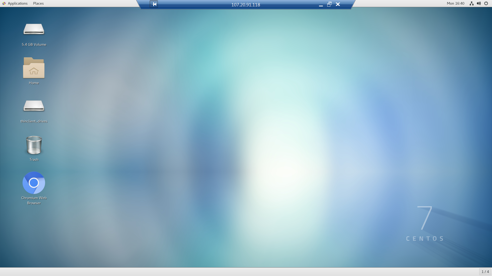
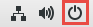
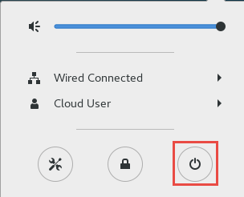
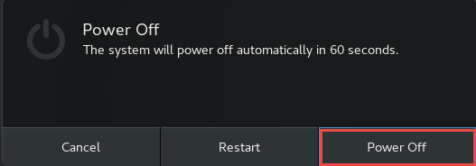
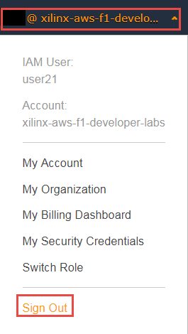
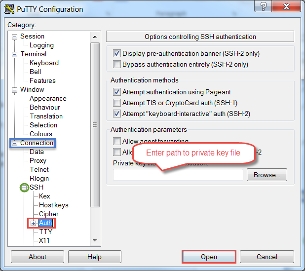

# Connecting to AWS

## Introduction

This lab guides you through the steps involved in connecting to an AWS EC2 F1 instance, and starting and stopping the instance.

## Objectives

After completing this lab, you will be able to:

- Connect to an AWS EC2 F1 instance using the provided credentials
- Starting an instance
- Starting a RDP (Remote Desktop Protocol) session
- Closing the RDP session
- Stopping the instance

## Procedure

This lab is separated into steps that consist of general overview statements that provide information on the detailed instructions that follow. Follow these detailed instructions to progress through the lab.

This lab comprises of three primary steps: You will login into an AWS and start an EC2 F1 instance. You will then interact with the instance remote desktop client, and then finally stop the running instance. Procedure on using PuTTy is provided in the Appendix.

## Step 1: Login into the AWS and starting an F1 instance

#### Each registered participant has been allocated a preconfigured EC2 F1 instance and should have received an email with the following details:
- Account ID, 
- IAM username, 
- Link to access a preconfigured EC2 F1 instance

### 1.1. Open a web browser and login into AWS EC2 F1 instance using the provided credentials
**1.1.1.** Start a web browser session

**1.1.2.** Either click on the provided link to open up an AWS login page OR enter [https://console.aws.amazon.com/ec2](https://console.aws.amazon.com/ec2) to open a login page

If you had used the link then you should see a login page similar to shown here:

#### Figure 1. Login page accessed through the provided link

If you had not used the link you may be directed to the AWS standard login page

#### Figure 2. Entering credentials manually

Enter *xilinx-aws-f1-developer-labs* in the Email address field and click **Next** to see the login page similar to shown in **Figure 1**

**1.1.3.** Enter _userxx_ in the **IAM user name** field and enter the provided password in the **Password** field

**1.1.4.** Click **Sign In**
### 1.2. Make sure to select N. Virginia (or instructor indicated region) as the region and start the instance
**1.2.1.** In the top right corner, using the drop-down button, select a region with F1 instances, such as **N. Virginia** (**US East)**

#### Figure 3. Selecting region

If you select different region other then where the accounts are created for then you may not see your instance as well as the source files which are pre-loaded for the workshop.

**1.2.2.** Click on the **EC2** link on the dashboard or if not visible, then click on the _Services_ drop-down button and then click on **EC2**

   
#### Figure 4. Accessing EC2 service

**1.2.3.** Click on the **Instances** link on the left panel


#### Figure 5. Accessing Instances

You may see several instances

**1.2.4.** Enter your username in the filter field just below the **Launch Instance** button and hit enter

#### Figure 6. Filtering your instance

**1.2.5.** Making sure that your instance is selected, click on the **Actions &gt; Instance State &gt; Start**

#### Figure 7. Starting an instance

**1.2.6.** Click on the **Yes, Start** button

**1.2.7.** Click on the refresh button() to see the updated status to _Running_


#### Figure 8. Running state

**1.2.8.** Make a note of the Public DNS and IPv4 Public IP which will be used by PuTTy and Remote Desktop (RDP)

#### Figure 9. Assigned IP to the running instance

## Step 2: Interacting with the Instance using RDP

**You can communicate with the instance using command line through PuTTY or Git Bash, and using GUI through remote desktop (RDP) connection.**

**2.1. Start a remote desktop session**

**2.1.1.** Start the remote desktop session

**2.1.2.** Enter the _IPv4_ address

**2.1.3.** Click on the **Show Options**


#### Figure 10. Entering the IPv4 address

**2.1.4.** Select the **Display** tab and select _True Color (24 bit)_ and click **Connect**

#### Figure 11. Selecting resolution and connecting

**2.1.5.** A certificate warning will be displayed. Click **Yes** to open the RDP session

**2.1.6.** Enter centos as the username and enter the provided password and click OK

#### Figure 12. Entering username and password

**2.1.7.** The desktop will be showed up

#### Figure 13. The RDP desktop

**2.1.8.** Right-click on the desktop and select **Open Terminal** to open a window

**2.1.9.** You should enter the following commands in any newly opened terminal window to source the environments

   ```
      cd ~/aws-fpga	  
      source sdaccel_setup.sh	  
      source $XILINX_SDX/settings64.sh
   ```

## Step 3: Stopping the Instance and Signing Out

**It is important to shut down the instance in order to stop billing meter**

### 3.1. Shut down the RDP instance using the top Power OFF button.

**3.1.1.** Click on the Power OFF button  located on the top right corner

**3.1.2.** A window will show up showing settings, lock, and power off buttons. Click on the Power OFF button

#### Figure 14. Power OFF window

**3.1.3.** Click on the **Power Off** option

#### Figure 15. Powering OFF the RDP connection

**3.1.4.** Enter the password to complete the process

**3.1.5.** Check the browser window, you will see status as either **Stopping** or **Stopped.** Click on the refresh button to see the status update
   
#### Figure 16. Instance Status

**3.1.6.** Once the instance is stopped, sign out by clicking on the drop-down button on the top bar and selecting Sign Out

#### Figure 17. Signing out

## Conclusion

In this lab, you learned how to connect to an AWS EC2 F1 instance, interact with the instance using PuTTy and RDP connection, how to stop the instance, and signing out.

---------------------------------------

<p align="center"><b>
Start the next lab: <a href="Makefile_Flow_lab.md">2. Makefile Flow</a>
</b></p>

---------------------------------------

## Appendix: Interacting with the Instance using Putty

**A.1 Connect using PuTTY.**

**A.1.1.** Start PuTTY program

**A.1.2.** Enter _centos@&lt;public\_dns\_entry&gt;_ in the **Host Name** field and **22** in the _Port_ field

Make sure that SSH is selected as the Connection type

#### Figure 18. Session settings in PuTTY

**A.1.3.** Expand **SSH** under the _Connection_ in the left panel and click **Auth**

**A.1.4.** Click on the **Browse…** button, browse to where the private key has been stored

If you don&#39;t have the private key file (as in workshop) you can skip this step

**A.1.5.** Click **Open**

#### Figure 19. Selecting private key file

**A.1.6.** Click **Yes**

The PuTTY window will open. It will ask for the password (in case of the workshop). Enter the provided password

#### Figure 20. The PuTTY window showing the connection

**A.1.7.** Set password for the RDP connection by entering sudo passwd &lt;your choice of password&gt; command. You will use the same password in the RDP connection.

**A.1.8.** Enter exit to close the session
