# GUI Flow

## Introduction

This lab guides you through the steps involved in using a GUI flow to create an SDAccel project. After creating a project you will run SW and hardware emulations to verify the functionality. You will then use an AWS F1 instance to validate the design, and perform profile and application timeline analysis.

## Objectives

After completing this lab, you will be able to:

- Create an SDAccel project through GUI flow
- Run SW Emulation to verify the functionality of a design using a GUI flow
- Run HW Emulation to verify the functionality of a design using a GUI flow
- Verify functionality in hardware on an AWS F1 instance
- Build system for hardware execution, and perform profile and application timeline analysis on the AWS F1 instance


## Steps
### Create an SDAccel Project        
1. Execute the following commands, if it is not already done, in a terminal window to source the required Xilinx tools:
   ```
      cd ~/aws-fpga		  
      source sdaccel_setup.sh		  
      source $XILINX_SDX/settings64.sh	  
   ```
1. Execute the following commands to create a working directory:
   ```
      mkdir GUI_flow	  
      cd GUI_flow
   ```
1. Launch SDAccel by executing **sdx** in the terminal window  
An Eclipse launcher window will appear asking to select a directory as workspace
1. Click on the **Browse…** button, browse to **/home/centos/aws-fpga/GUI\_flow**, click **OK** twice
    <p align="center">
    
    </p>
    <p align = "center">
    <i>Selecting a workspace</i>
    </p>
    The Xilinx SDx IDE window will be displayed. Notice that the Welcome screen is gray-shaded as nothing has been done at this stage
    <p align="center">
    
    </p>
    <p align = "center">
    <i>The SDx IDE window</i>
    </p>
1. Click on the **Add Custom Platform** link on the _Welcome_ page
1. Click on the **Add Custom Platform** button, browse to **/home/centos/aws-fpga/SDAccel/aws\_platfom/xilinx\_aws-vu9p-f1-04261818\_dynamic\_5\_0**, and click **OK**
    <p align="center">
    
    </p>
    <p align = "center">
    <i>Hardware platform selected</i>
    </p>
1. Click **Apply** and then click **OK**  
   Notice that the Welcome screen is no longer gray-shaded since a platform is already defined
1. Click on the **Create SDx Project** link on the _Welcome_ page  
    The _Project Type_ page will be displayed 
1. Select **Application** and click **Next**
1. In the _New Project_&#39;s page enter **gui\_flow\_example** in the _Project name:_ field and click **Next**  
Note the _aws-vu9p-f1-04261818_ under the board column is displayed 
1. Click **Next**
1. Click **Next** with _Linux on x86_ as the System Configuration and _OpenCL_ as the Runtime options
1. Select **Vector Addition** from the _Templates_ pane and click **Finish**
    <p align="center">
    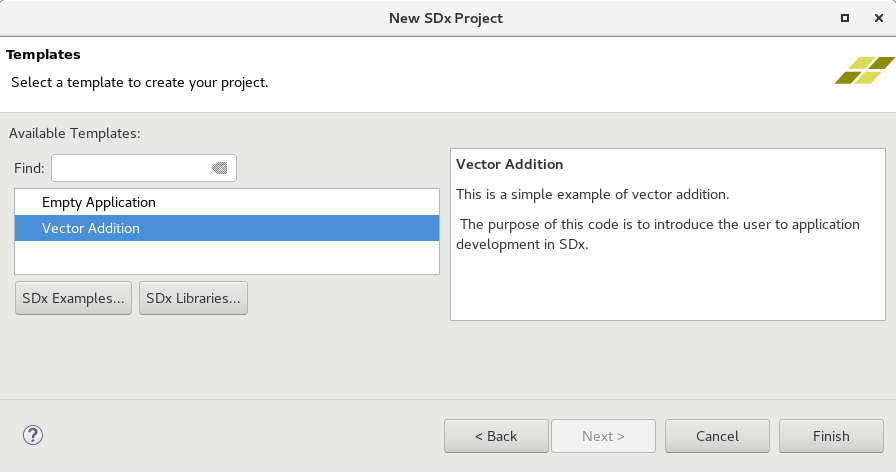
    </p>
    <p align = "center">
    <i>Selecting an application template</i>
    </p>
    The project IDE will be displayed with six main windows: Project Explorer, Project Settings, Assistant, Outline, multi-tab console, and Emulation Console.
    <p align="center">
    
    </p>
    <p align = "center">
    <i>The Project IDE</i>
    </p>

### Perform SW Emulation
1. Click on the _Add Hardware Function_ button icon () in the **Hardware Functions** tab to see functions defined in the design. Since there is only one function and it is already included, you won't see any listing  
1. Notice the _kml\_vadd_ function is the only function in the design and is already marked to be accelerated
1. Make sure the **project.sdx** under _gui\_flow\_example_ in the **Project Explorer** tab is selected
1. Either select **Project &gt; Build Configurations &gt; Set Active &gt; Emulation-SW** or click on the drop-down button of _Active build configuration_ and select **Emulation-SW**
    <p align="center">
    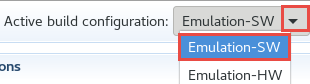
    </p>
    <p align = "center">
    <i>Selecting SW Emulation build configuration</i>
    </p>
1. Either select **Project &gt; Build Project** or click on the build () button  
    This will build the project including gui\_flow\_example.exe file under the Emulation-SW directory
1. Run the application by clicking the Run button (). 
    The application will be run and the output will be displayed in the Console tab
    <p align="center">
    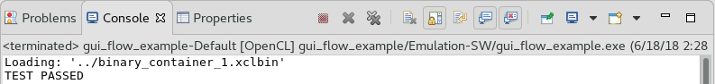
    </p>
    <p align = "center">
    <i>SW Emulation run output</i>
    </p>

### Perform HW Emulation
**The SW Emulation flow checks functional correctness of the software application, but it does not guarantee the correctness of the design on the FPGA target. The Hardware (HW) Emulation flow can be used to verify the functionality of the generated logic. This flow invokes the hardware simulator in the SDAccel environment. As a consequence, the HW Emulation flow will take longer to run than the SW Emulation flow.**

**The HW Emulation flow is not cycle accurate, but provides more detailed profiling information than software emulation and can be used to do some analysis and optimization of the performance of the application.**

1. Either select **Project &gt; Build Configurations &gt; Set Active &gt; Emulation-HW** or click on the drop-down button of _Active build configuration_ and select **Emulation-HW**
    <p align="center">
    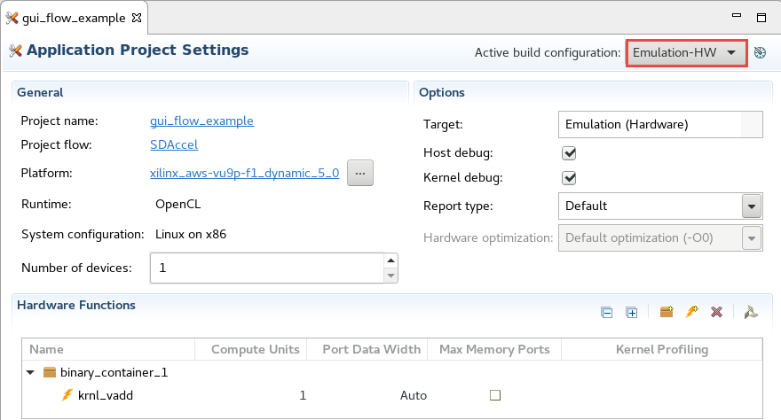
    </p>
    <p align = "center">
    <i>Selecting HW Emulation build configuration</i>
    </p>
1. Either select **Project &gt; Build Project** or click on the () button  
    This will build the project including gui\_flow\_example.exe file under the Emulation-HW directory
1. Select **Run &gt; Run Configurations…** to open the configurations window
1. Click on the **Environemnt** tab and change the LD_LIBRARY_PATH to **/opt/xilinx/xrt/lib**, leaving the other two variables to the default settings. This is required to see activities on the Kernel side using Xilinx Run Time library (xrt)
    <p align="center">
    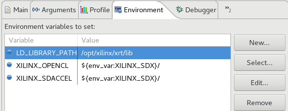
    </p>
    <p align = "center">
    <i>Editing Environment tab</i>
    </p>
1. Click on the **Arguments** tab and notice that the _binary\_container\_1.xclbin_ is already assigned  
    If no argument was assigned then you would have to explicitly assign the **xclbin** by clicking on the _Automatically add binary container(s) to arguments_ 
1. Click **Apply**
    <p align="center">
    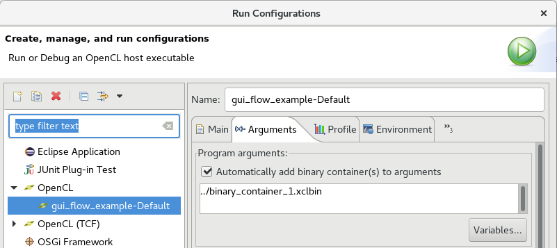
    </p>
    <p align = "center">
    <i>Populated Arguments tab</i>
    </p>
1. Click **Run** to run the application
1. The Console tab shows that the test was completed successfully along with the data transfer rate
    <p align="center">
    
    </p>
    <p align = "center">
    <i>Hardware Emulation run output</i>
    </p>

### Review the HLS Report
1. Double-click on the **HLS Report** entry under **Emulation-HW &gt; binary\_container\_1 &gt; krnl\_vadd** in the **Assistant** tab to open the report
    <p align="center">
    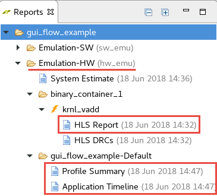
    </p>
    <p align = "center">
    <i>The Assistant tab content</i>
    </p>
    The window will open showing the Synthesis report for the **krnl\_vadd** accelerator.  It includes the target device information
    <p align="center">
    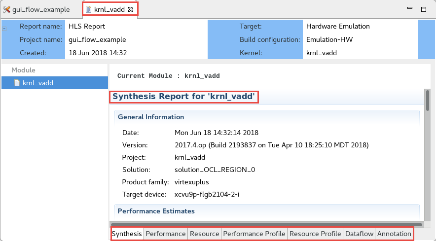
    </p>
    <p align = "center">
    <i>HLS synthesis report for the krnl_vadd accelerator</i>
    </p>
1. Scroll down the window and observe the timing, latency, and loop performance results. Observe that the target frequency is 250 MHz (4 ns period) and achieved period is 2.92 ns indicating that the timing has been met. 
    <p align="center">
    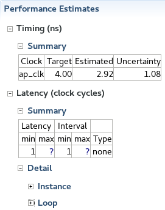
    </p>
    <p align = "center">
    <i>Performance estimate results</i>
    </p>
1. Scroll down further and observe the resource utilization by the accelerator
    <p align="center">
    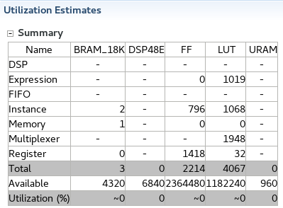
    </p>
    <p align = "center">
    <i>Resource utilization</i>
    </p>
1. Scrolling down further shows the Interface summary indicating various ports, width, protocol that they are part of, type of object, and parameter type they belong to.  
    As can be seen, there are three interfaces being used: control, s\_axi, and m\_axi. The s\_axi is 32-bit wide data, control provides necessary handshaking signals, and m\_axi has 32-bit data. The m\_axi is connected to gmem, the global memory which is DDR. The DDR memory uses 64-bit address.
    <p align="center">
    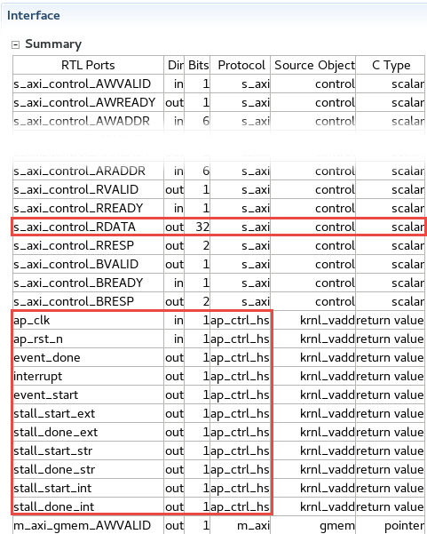  
    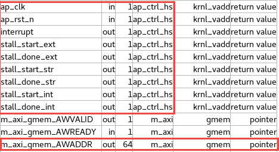  
    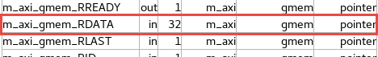
    </p>
    <p align = "center">
    <i>Interface details showing ports, direction, size, protocol, object and data types</i>
    </p>

###  Review the profile summary report
1. Double-click on the **Profile Summary** entry under **Emulation-HW &gt; gui\_flow\_example-Default** in the **Assistant** tab  
    Notice a multi-tab report window is opened. It has four tabs: the Top Operations, Kernels and Compute Units, the Data Transfers, and the OpenCL APIs. The Top Operations tab shows the device being used, the Global work size (1:1:1), and the Local work size (1:1:1). It also shows the kernel (krnl\_vadd) being used, the location of the kernel, beside the context ID.
    <p align="center">
    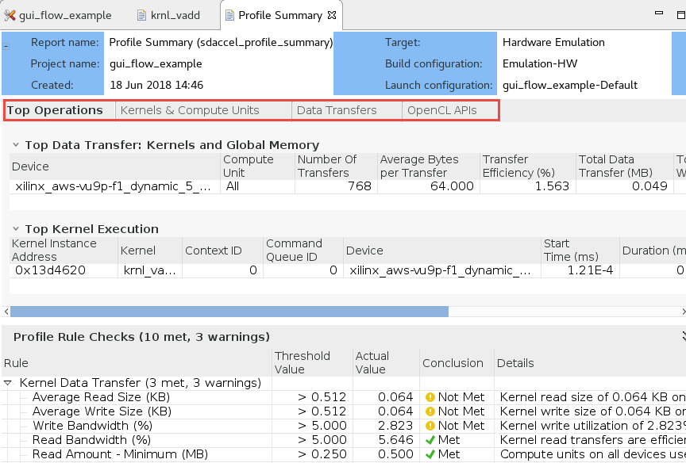
    </p>
    <p align = "center">
    <i>Top operation information in the profile summary</i>
    </p>
1. Click on the **Kernels &amp; Compute Units** tab and observe the number of Enqueues (1), and the execution time (0.051 ms)
    <p align="center">
    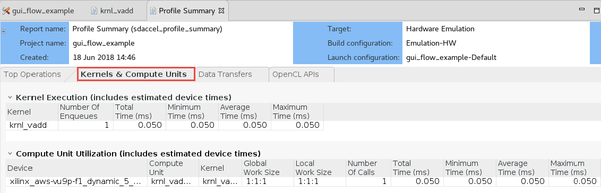
    </p>
    <p align = "center">
    <i>Kernel and compute unit information in the profile summary</i>
    </p>
1. Click on the **Data Transfers** tab and observe the number of read (1, result read), the number of write (2, two source operands being written), and the average size (16.384 KB) between the host and memory. 
    <p align="center">
    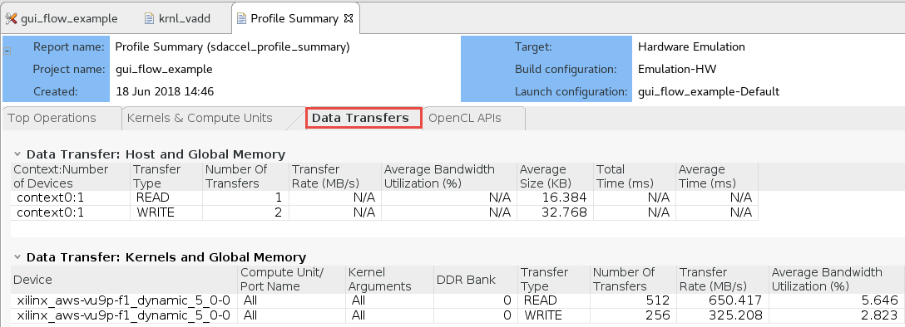
    </p>
    <p align = "center">
    <i>Data transfer information in the profile summary</i>
    </p>

### Review the Application Timeline report
1. Double-click on the **Application Timeline** entry in the **Assistant** tab, expand all entries in the timeline graph, zoom appropriately and observe the transactions. You will see when the kernel is running, when the write transaction takes place between host and global memory, when the read transactions are taking place between global memory and kernel memory, when the write transactions are taking place between the kernel and global memory, and when the read transaction is taking place between the global memory and host.
    <p align="center">
    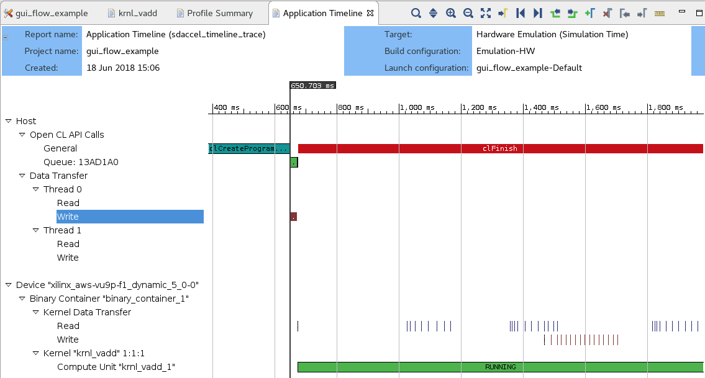
    </p>
    <p align = "center">
    <i>Timeline graph showing various activities in various region of the system</i>
    </p>

### Review the System Estimate report
1. Double-click on the **System Estimate** entry under the **Emulation-HW** in the **Assistant** tab
1. The report shows the estimated frequency and the resource utilization for the given kernel (krnl\_vadd)
    <p align="center">
    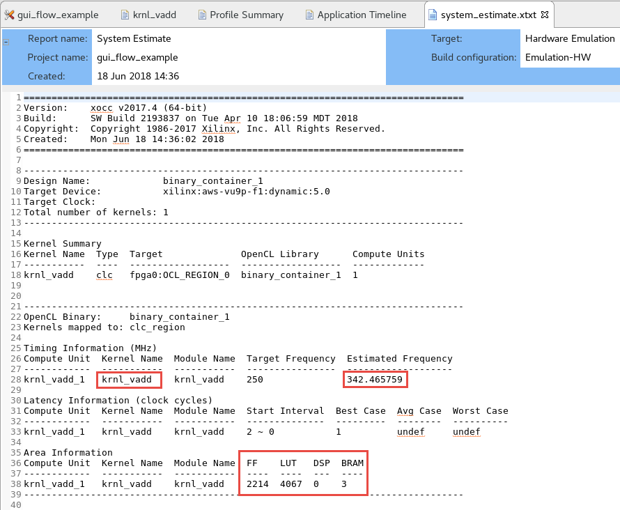
    </p>
    <p align = "center">
    <i>The system estimate report</i>
    </p>

### Setup for System Build
**Since hardware bitstream generation takes over two hours, you will go through basic steps involved in setting up System build in this section so you can perform profiling and application timeline analysis on AWS using the already pre-generated awsxclbin.**

1. Either select **Project &gt; Build Configurations &gt; Set Active &gt; System** or click on the drop-down button of _Active build configuration_ and select **System**
1. Click on the drop-down button of Hardware optimization and select -Oquick option which will make compilation relatively faster
    <p align="center">
    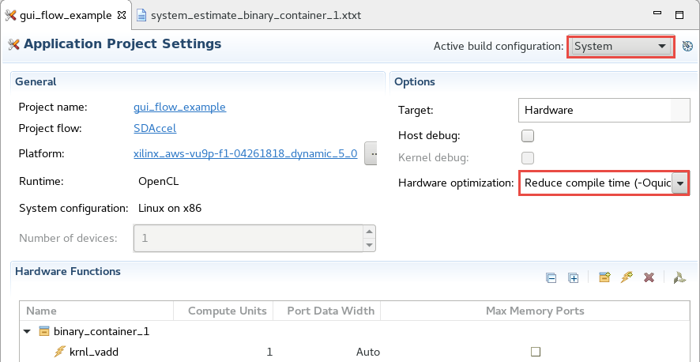
    </p>
    <p align = "center">
    <i>Selecting System build configuration and setting compilation option</i>
    </p>
1. In the **Assistant** tab, expand **gui_flow_example > System > binary_container_1 > krnl_vadd**, right-click and select **Settings...**
1. In the **Hardware Function Settings** window, select **Counters + Trace** using _Data Transfer_ drop-down button, click the **Execute Profiling** and **Stall Profiling** options, click **Apply**, and click **OK**
    <p align="center">
    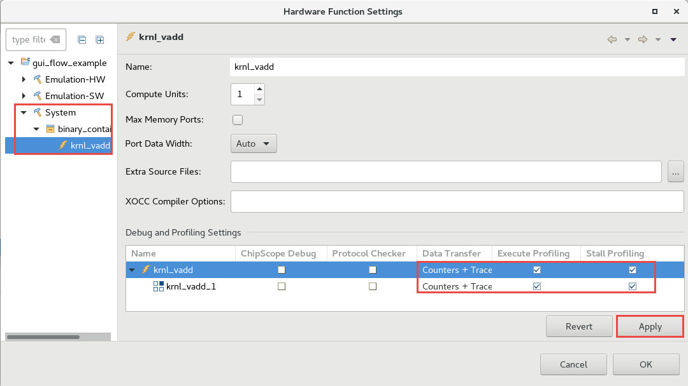
    </p>
    <p align = "center">
    <i>Selecting System build configuration and setting compilation option</i>
    </p>
1. Normally, you would build the project, but since it will take long time **you will NOT BUILD it here**

### Run the Application on F1
**Since the System build and AFI availability takes considerable amount of time, a precompiled version is provided. Use the precompiled solution directory to verify the functionality.**  

1. Change to the solution directory by executing the following command  
   ```
      cd /home/centos/sources/gui_flow_solution
   ```  
1. Run the following commands to load the runtime environment and execute the application  
   ```
      sudo sh
      source /opt/xilinx/xrt/setup.sh
      ./gui_flow_example.exe xclbin/binary_container_1.awsxclbin
   ```
1. The FPGA bitstream will be downloaded and the host application will be executed showing output something like:
    <p align="center">
    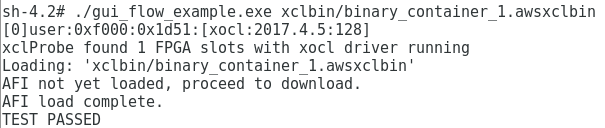
    </p>
    <p align = "center">
    <i>The Execution output</i>
    </p>  
1. It will also create two csv files; one for profile and another application timeline analysis
1. Open another terminal window (_non-sh_), source the environment settings, and execute the following two commands to create \*.xprf (Xilinx profile), and timeline.wdb and timeline.wcfg files
   ```
      cd ~/aws-fpga		  
      source sdaccel_setup.sh		  
      source $XILINX_SDX/settings64.sh	  
      sdx_analyze profile --input sdaccel_profile_summary.csv -o profile
      sdx_analyze trace --input sdaccel_timeline_trace.csv -o timeline
   ```

### Perform Profiling and Application Timeline Analysis on AWS F1 Using the Generate Files
**You will use the generated timeline and profile files to perform the analysis**

1. Select **File > Open File...**
1. Browse to **/home/centos/sources/gui_flow_solution** and select **profile.xprf** and **timeline.wdb** and click **OK**
The _Waveform and Profile Summary tabs_ will open. In the Waveform tab, notice that the actual activities starts after 4,960 ms since the FPGA loading takes time
1. Run the application again from the command line of the **sh** terminal window and observe the output  
It indicates the AFI is already loaded and so it is skipping the loading
    <p align="center">
    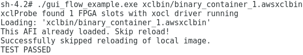
    </p>
    <p align = "center">
    <i>The Execution output of the second time running</i>
    </p>  
1. Generate the profile and trace files from the _non-sh_ terminal window as done earlier
1. Close the Waveform and Profile Summary tabs and open the two files again  
Notice that the activity starts at around 500 ms as no AFI loading took place.
1. Select the **Profile Summary** tab and observe the Total Data Transfer between Kernels and Global Memory, and Top Kernel Execution Duration  
    <p align="center">
    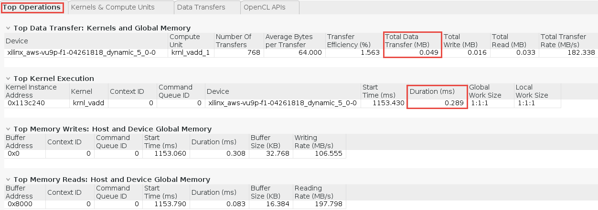
    </p>
    <p align = "center">
    <i>Top operation information in the profile summary</i>
    </p>
1. Click on the **Kernels &amp; Compute Units** tab and observe the number of Enqueues (1), and the execution time (0.289 ms). Also understand the **Compute Uni Utilization** and **Compute Units: Stall Information** section
    <p align="center">
    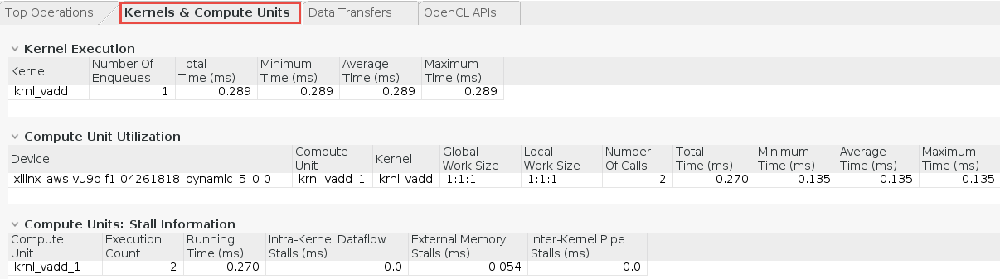
    </p>
    <p align = "center">
    <i>Kernel and compute unit information in the profile summary</i>
    </p>
1. Click on the **Data Transfers** tab and observe the data transfer rate between the host and memory, and the data transfer rate between kernels and global memory
    <p align="center">
    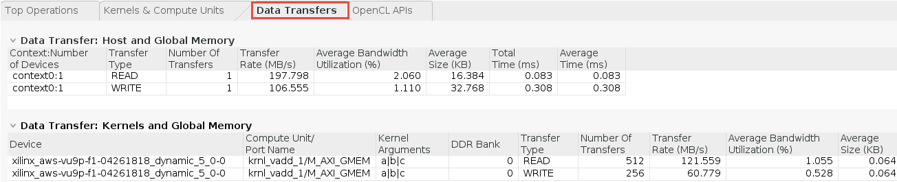
    </p>
    <p align = "center">
    <i>Data transfer information in the profile summary</i>
    </p>

1. Select the **Waveform** tab, expand all entries in the timeline graph and see various activities in each fucntional units of the design
    <p align="center">
    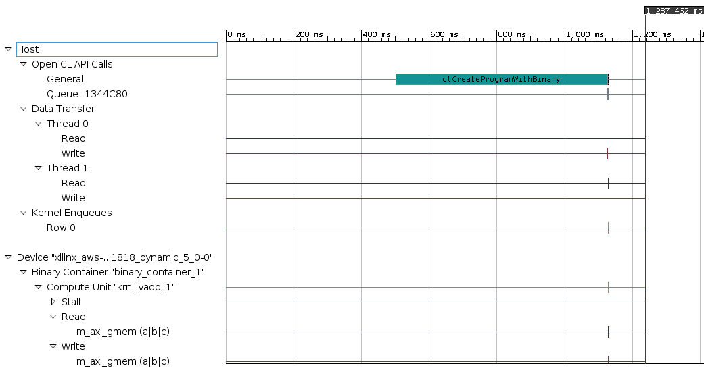
    </p>
    <p align = "center">
    <i>Timeline graph showing various activities in various region of the system</i>
    </p>
1. Using left-button mouse click, select region around 1.150 ms to 1.154 ms region to zoom in into the view
    <p align="center">
    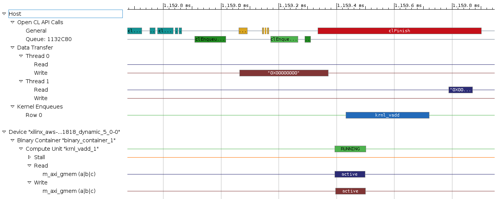
    </p>
    <p align = "center">
    <i>Zoomed in view showing various activites</i>
    </p>

## Conclusion 

In this lab, you used SDAccel IDE to create a project using one of the application templates. You then ran the design using the software  and hardware emulation flows, and reviewed the reports. You also read through the steps to generate the AFI. Since the system build and AFI creation takes over two hours, you used the provided solution to download the application and kernel on the F1 instance and validated the functionality.

---------------------------------------

<p align="center"><b>
Start the next lab: <a href="Optimization_lab.md">4. Optimization Lab</a>
</b></p>

---------------------------------------


## Appendix: Build Full Hardware
**Set the build configuration to System and build the system (Note that since the building of the project takes over two hours skip this step in the workshop environment).**  
1. Either select **Project &gt; Build Configurations &gt; Set Active &gt; System** or click on the drop-down button of _Active build configuration_ and select **System**  
1. Either select **Project &gt; Build Project** or click on the () button    
This will build the project under the **System** directory. The built project will include **gui\_flow\_example.exe** file along with **binary\_container\_1.xclbin** file. This step takes about two hours  

**Once the full system is built, you can create an AFI by following the steps listed <a href="Creating_AFI.md">here</a>**

## Appendix: Performing Application Timeline and Profile Analysis
**If you are using your own instance, follow below steps to perform the analysis after you have have build the full bitstream and created AFI** 

1. Replace (after changing the extension) the **binary_container_1.xclbin** file with the registered **binary_container_1.awsxclbin** in the **System** directory
1. Before you can run the application in hardware on AWS F1, you will need to start the SDx program in the **su** mode
1. Run the following commands to setup the environment and start the SDx program  
   ```
      sudo sh
      source /opt/xilinx/xrt/setup.sh
      /opt/Xilinx/SDx/2018.2.op2258646/bin/sdx&
   ```
1. Click on the **Browse…** button of the _Workspace_ window, browse to **/home/centos/aws-fpga/GUI\_flow**, click **OK**   
The _gui_flow_example_ project will open
1. In the **Assistant** tab, right-click on **System** and select **Run > Run Configurations**
1. In the _Main_ tab, select **System** as the _Run Configuration_
    <p align="center">
    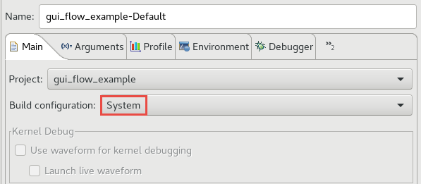
    </p>
    <p align = "center">
    <i>Selecting System as the active run configuration</i>
    </p>  
1. In the _Profile_ tab, make sure that Enable Profiling option is selected
1. Click on the drop-down button of the **Generate timeline trace report:** field and select **Yes**
    <p align="center">
    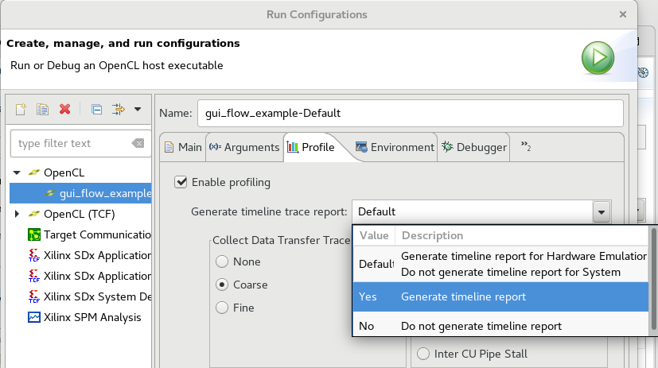
    </p>
    <p align = "center">
    <i>Selecting to generate timeline trace report</i>
    </p>  
1. Select **Internal Dataflow Stall** as an option of _Collect State Trace_
    <p align="center">
    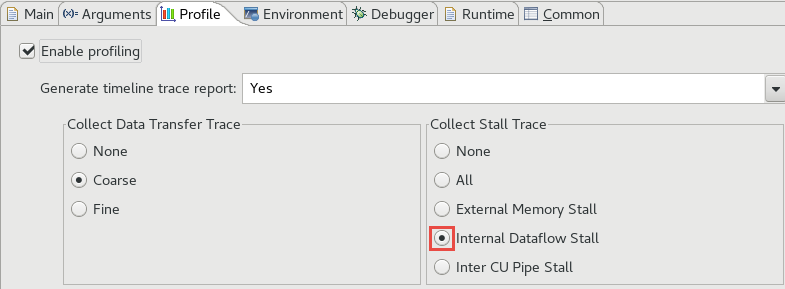
    </p>
    <p align = "center">
    <i>Selecting type of trace to collect</i>
    </p>  
1. In the **Arguments** tab, make sure that **../binary_container_1.xclbin** is selected
1. In the **Environment** tab make sure that the **LD_LIBRARY_PATH** is set to **/opt/xilinx/xrt/lib**
1. Click **Apply** and **Run** to execute the application through GUI
1. Once, the execution is completed, double-click on the **Profile Summary** entry under **System &gt; gui\_flow\_example-Default** in the **Assistant** tab  
    The profile report will open.
1. Double-click on the **Application Timeline** entry in the **Assistant** tab, expand all entries in the timeline graph and see various activities in each fucntional units of the design
