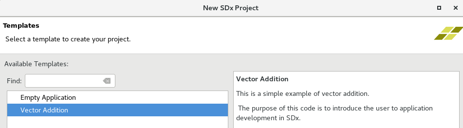

# GUI Flow

## Introduction

This lab guides you through the steps involved in using a GUI flow to create an SDAccel project. After creating a project you will run CPU and hardware emulations to verify the functionality. You will then use an AWS F1 instance to validate the design.

## Objectives

After completing this lab, you will be able to:

- Create an SDAccel project through GUI flow
- Run CPU Emulation to verify the functionality of a design using a GUI flow
- Run HW Emulation to verify the functionality of a design using a GUI flow
- Verify functionality in hardware on an AWS F1 instance

## Procedure

This lab is separated into steps that consist of general overview statements that provide information on the detailed instructions that follow. Follow these detailed instructions to progress through the lab.

This lab comprises four primary steps: You will create an SDAccel project using one of the standard application templates. You will perform CPU emulation to validate application then perform HW emulation to see how much acceleration is possible. Next you will  download the bitstream on F1 and validate application execution. The Appendix section lists steps involved in building the full hardware.

## Step 1: Create an SDAccel Project        
### 1.1. Source the SDAccel settings and create a directory called GUI\_flow under _~/aws-fpga_. Change the directory to the newly created directory.
**1.1.1.** Execute the following commands in a terminal window to source the required Xilinx tools:

   ```
      cd ~/aws-fpga		  
      source sdaccel_setup.sh		  
      source $XILINX_SDX/settings64.sh	  
   ```
**1.1.2.** Execute the following commands to create a working directory:

   ```
      mkdir GUI_flow	  
      cd GUI_flow
   ```

### 1.2. Launch SDx, create a workspace and create a project, called _GUI\_flow_, using the _Vector Addition_ template.
**1.2.1.** Launch SDAccel by executing **sdx** in the terminal window

An Eclipse launcher widow will appear asking to select a directory as workspace

**1.2.2.** Click on the **Browse…** button, browse to **/home/centos/aws-fpga/GUI\_flow**, click **OK** twice


#### Figure 1. Selecting a workspace

The Xilinx SDx IDE window will be displayed


#### Figure 2. The SDx IDE window

**1.2.3.** Click on the **Add Custom Platform** link on the _Welcome_ page

**1.2.4.** Click on the **Add Custom Platform** button, browse to **/home/centos/src/project_data/aws-fpga/SDAccel/aws\_platfom/xilinx\_aws-vu9p-f1\_dynamic\_5\_0** , and click **OK**
 

#### Figure 3. Hardware platform selected

**1.2.5.** Click **Apply** and then click **OK**

**1.2.6.** Click on the **Create SDx Project** link on the _Welcome_ page

**1.2.7.** In the _New Project_&#39;s page enter **gui\_flow\_example** in the _Project name:_ field and click **Next**

Note the AWS-VU9P-F1 board is displayed as the hardware platform

**1.2.8.** Click **Next**

**1.2.9.** Click **Next** with Linux on x86 as the System Configuration and OpenCL as the Runtime options

**1.2.10.** Select **Vector Addition** from the _Available Templates_ pane and click **Finish**


#### Figure 4. Selecting an application template

The project IDE will be displayed with six main windows: Project Explorer, Project Settings, Reports, Outline, multi-tab console, and Emulation Console.


#### Figure 5. Project IDE

## Step 2: Perform CPU Emulation
### **2.1.** Select the function(s) that needs to be accelerated.

**2.1.1.** Click on the _Add Hardware Function_ button icon () in the **Hardware Functions** tab to see the functions defined in the design

**2.1.2.** Notice the _kml\_vadd_ function is the only function in the design and is already marked to be accelerated

**2.1.3.** Make sure the **project.sdx** under _gui\_flow\_example_ in the **Project Explorer** tab is selected

**2.1.4.** Either select **Project &gt; Build Configurations &gt; Set Active &gt; Emulation-CPU** or click on the drop-down button of _Active build configuration_ and select **Emulation-CPU**


#### Figure 6. Selecting CPU emulation build configuration


**2.1.5.** Either select **Project &gt; Build Project** or click on the build () button

This will build the project including gui\_flow\_example.exe file under the Emulation-CPU directory

**2.1.6.** Run the application by clicking the Run button ()

The application will be run and the output will be displayed in the Console tab


#### Figure 7. CPU Emulation run output

## Step 3: Perform HW Emulation

#### The SW Emulation flow checks functional correctness of the software application, but it does not guarantee the correctness of the design on the FPGA target. The Hardware Emulation flow can be used to verify the functionality of the generated logic. This flow invokes the hardware simulator in the SDAccel environment. As a consequence, the Hardware Emulation flow will take longer to run than the SW Emulation flow.

#### The HW Emulation flow is not cycle accurate, but provides more detailed profiling information than software emulation and can be used to do some analysis and optimization of the performance of the application.

### 3.1. Select the Emulation-HW build configuration and build the project.
**3.1.1.** Either select **Project &gt; Build Configurations &gt; Set Active &gt; Emulation-HW** or click on the drop-down button of _Active build configuration_ and select **Emulation-HW**


#### Figure 8. Selecting HW emulation build configuration

**3.1.2.** Either select **Project &gt; Build Project** or click on the () button

This will build the project including gui\_flow\_example.exe file under the Emulation-HW directory

**3.1.3.** Select **Run &gt; Run Configurations…** to open the configurations window

**3.1.4.** Click on the **Arguments** tab and notice that the _binary\_container\_1.xclbin_ is already assigned

If no argument was assigned then you would have to explicitly assign the **xclbin** by clicking on the _Automatically add binary container(s) to arguments_, and click **Apply**


#### Figure 9. Populated Arguments tab

**3.1.5.** Click **Run** to run the application

**3.1.6.** The Console tab shows that the test was completed successfully along with the data transfer rate


#### Figure 10. Hardware emulation run output

### 3.2. Understand the HLS Report, profile summary, and Application Timeline.
**3.2.1.** Double-click on the **HLS Report** entry under _Emulation-HW &gt; binary\_container\_1 &gt; krnl\_vadd_ in the _Reports_ view to open the report


#### Figure 11. The Report view

The multi-tab window will open showing the Synthesis report for krnl\_vadd accelerator.  It includes the target device information


#### Figure 12. Multi-tab HLS synthesis report for krnl\_vadd accelerator

**3.2.2.** Scroll down the window and observe the timing, latency, and loop performance results. Observe that the target frequency is 250 MHz (4 ns period) and achieved period is 2.92 ns indicating that the timing has been met. 


#### Figure 13. Performance estimate results

**3.2.3.** Scroll further down and observe the resource utilization by the accelerator


#### Figure 14. Resource utilization

**3.2.4.** Scrolling down further shows the Interface summary indicating various ports, width, protocol that they are part of, type of object, and parameter type they belong to.

As can be seen, there are three interfaces being used: control, s\_axi, and m\_axi. The s\_axi is 32-bit wide data, control provides necessary handshaking signals, and m\_axi has 32-bit data. The m\_axi is connected to gmem, the global memory which is DDR. The DDR memory uses 64-bit address.


#### Figure 15. Interface details showing ports, direction, size, protocol, object and data types

### 3.3. Review the profile summary report
**3.3.1.** Double-click on the **Profile Summary** entry under _Emulation-HW &gt; gui\_flow\_example-Default_ in the _Reports_ tab

Notice a multi-tab report window is opened. It has four tabs: the Top Operations, Kernels and Compute Units, the Data Transfers, and the OpenCL APIs. The Top Operations tab shows the device being used, the number of transfers (2112), average bytes per transfer (5.818), and the transfer efficiency. It also shows the kernel (krnl\_vadd) being used, the location of the kernel, beside the context ID.


#### Figure 16. Top operation information in the profile summary

**3.3.2.** Click on the **Kernels &amp; Compute Units** tab and observe the number of Enqueues (1), the Global work size (1:1:1), the Local work size (1:1:1) and the number of calls to the kernel (1)


#### Figure 17. Kernel and computer unit information in the profile summary

**3.3.3.** Click on the **Data Transfers** tab and observe the number of read (1, result read), the number of write (2, two source operands being written), and the average size (4096 KB) between the host and memory. It also shows the number of read (2048, read data), the number write (64, write data), the transfer rates, and the average time.


#### Figure 18. Data transfer information in the profile summary

### 3.4. Review the Application Timeline report
**3.4.1.** Double-click on the **Application Timeline** entry in the _Reports_ tab, expand all entries in the timeline graph, zoom appropriately and observe the transactions. You will see when the kernel is running, when the write transaction takes place between host and global memory, when the read transactions are taking place between global memory and kernel memory, when the write transactions are taking place between the kernel and global memory, and when the read transaction is taking place between the global memory and host.


#### Figure 19. Timeline graph showing various activities in various region of the system

### 3.5. Review the System Estimate report.
**3.5.1.** Double-click on the **System Estimate** entry under the _Emulation-HW_ in the _Reports_ tab

**3.5.2.** The report shows the estimated frequency and the resource utilization for the given kernel (krnl\_vadd)


#### Figure 20. The system estimate report

## Step 4: Run the Application on F1
### 4.1. Since the System build and AFI availability takes considerable amount of time, a precompiled version is provided. Use the precompiled solution directory to verify the functionality.
**4.1.1.** Change to the solution directory by executing the following command

   ```
      cd /home/centos/sources/gui_flow_solution
   ```

**4.1.2.** Run the following commands to load the AFI and execute the application to verify the functionality

   ```
      sudo sh
      source /opt/Xilinx/SDx/2017.4.rte.dyn/setup.sh
      ./gui_flow_example.exe xclbin/binary_container_1.awsxclbin
   ```
**4.1.3.** The FPGA bitstream will be downloaded and the host application will be executed showing output something like:


#### Figure 21. Execution output

**4.1.4.** Enter **exit** in the teminal window to exit out of sudo shell.

**4.1.5.** Close the SDx by selecting **File &gt; Exit**

## Conclusion 

In this lab, you used SDAccel IDE to create a project using one of the application templates. You then ran the design using the software emulation and hardware emulation flows, and reviewed the reports. You also read through the steps to generate the AFI. Since the system build and AFI creation takes over two hours, you used the provided solution to download the application and kernel on the F1 instance and validated the functionality.

---------------------------------------

<p align="center"><b>
Start the next lab: <a href="Optimization_lab.md">4. Optimization Lab</a>
</b></p>

---------------------------------------


## Appendix: Build Full Hardware
### A.1. Set the build configuration to System and build the system (Note that since the building of the project takes over two hours skip this step in the workshop environment and move to next step).
**A.1.1.** Either select **Project &gt; Build Configurations &gt; Set Active &gt; System** or click on the drop-down button of _Active build configuration_ and select **System**

**A.1.2.** Either select **Project &gt; Build Project** or click on the () button

This will build the project under the **System** directory. The built project will include gui\_flow\_example.exe file along with binary\_container\_1.xclbin file

This step takes about two hours

### A.2. Create an Amazon FPGA Image (AFI).

To execute the application on F1, the following files are needed:

- Host application (exe)
- FPGA binary (xclbin)
- Amazon FPGA Image (awsxclbin)

The xclbin and the host applications are already generated by the System configuration step

**A.2.1.** Create a **xclbin** directory under the _GUI\_flow_ directory using the following commands:

   ```
      cd /home/centos/aws-fpga/GUI_flow
      mkdir xclbin
   ```
**A.2.2.** Copy the generated **xclbin** file ( **binary\_container\_1.xclbin** ) and the host application (gui\_kernel\_example.exe) from the **System** folder into the created **xclbin** directory, using the following commands

   ```
      cd xclbin
      cp /home/centos/aws-fpga/GUI_flow/gui_flow_example/System/binary_container_1.xclbin .
      cp /home/centos/aws-fpga/GUI_flow/gui_flow_example/System/gui_flow_example.exe .
   ```
### A.3. Create an AFI by running the create\_sdaccel\_afi.sh script and wait for the completion of the AFI creation process
**A.3.1.** Enter the following command to generate the AFI:
   ```
      $SDACCEL_DIR/tools/create_sdaccel_afi.sh –xclbin=binary_container_1.xclbin –s3_bucket=<bucket-name> -s3_dcp_key=<dcp-folder-name> -s3_logs_key=<logs-folder-name>
   ```
In the above command, &lt;bucket-name&gt;, &lt;dcp-folder-name&gt;, and &lt;logs-folder-name&gt; are the names you would have given when running CLI script.  In the workshop environment this was already done.

The create\_sdaccel\_afi.sh script does the following:

- Starts a background process to create the AFI
- Generates a \_afi\_id.txt which contains the FPGA Image Identifier (or AFI ID) and Global FPGA Image Identifier (or AGFI ID) of the generated AFIs
- Creates the \*.awsxclbin AWS FPGA binary file which will need to be read by the host application to determine which AFI should be loaded in the FPGA.

**A.3.2.** Enter the following command to note the values of the AFI IDs by opening the *\_afi\_id.txt file.

   ```
      cat *afi_id.txt
   ```
**A.3.3.** Enter the **describe-fpga-images** API command to check the status of the AFI generation process:

   ```
      aws ec2 describe-fpga-images --fpga-image-ids <AFI ID>
   ```

Note: When AFI creation completes successfully, the output should contain:

   ```
      ...
      "State": {
          "Code": "available"
      },
      
      ...
   ```
**A.3.4.** Wait until the AFI becomes available before proceeding to execute on the F1 instance.

