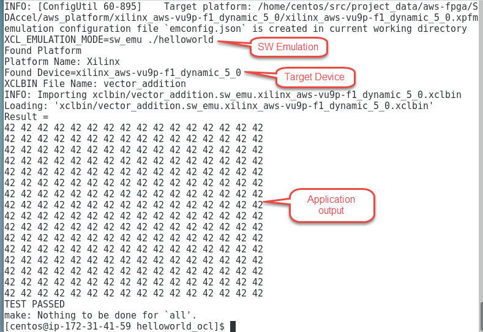
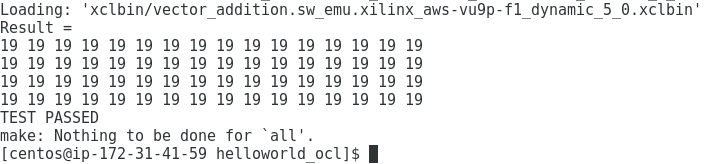
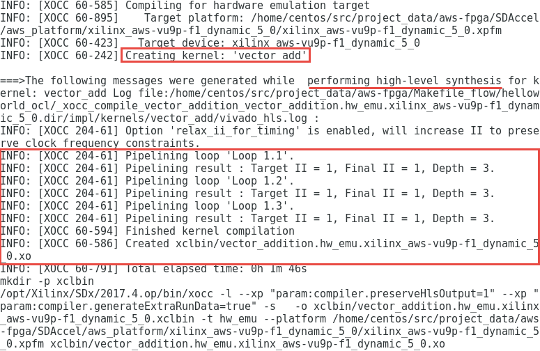
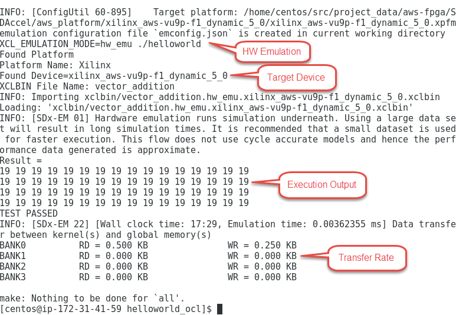
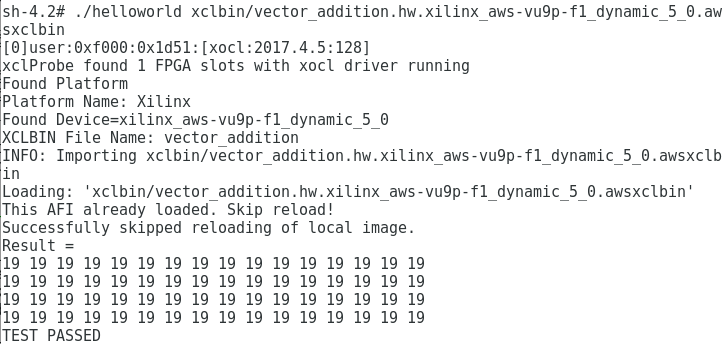

# Makefile Flow

## Introduction

This lab guides you through the steps involved in using a Makefile flow to build and perform software and hardware emulations to verify the functionality. You will then use an AWS F1 instance to validate the design.

## Objectives

After completing this lab, you will be able to:

- Run SW Emulation to verify the functionality of a design using a Makefile flow
- Run HW Emulation to verify the functionality including kernel hardware using a Makefile flow
- Build the full system and verify functionality in hardware on an AWS F1 instance

## Steps 
### Source Environment Settings        

1. Right-click on the Centos desktop and select **Open Terminal**
1. Execute the following commands in the terminal window to source the Xilinx tools
   ```
      cd ~/aws-fpga	  
      source sdaccel_setup.sh		  
      source $XILINX_SDX/settings64.sh
   ```
1. Create a **Makefile\_flow** directory and change the working directory into it using the following commands:
   ```
      mkdir Makefile_flow	  
      cd Makefile_flow		  
   ```
1. Copy the provided helloworld\_ocl project directory into the current working directory using the following command:
   ```
      cp -r /home/centos/sources/helloworld_ocl/ .
   ```
### Build and Run Emulation Flows using Makefile Flow

The SDAccel emulation flows allow testing, profiling and debugging of the application before deploying on F1.  
Software emulation allow functionality of the software application to be verified.  
Hardware emulation allow the verification of the functionality of the generated logic generated for the FPGA and the application working together.

1. Execute the following commands in the terminal to build and run the *SW emulation* flow for the SDAccel &#39;hello world&#39; example:
    ```
      cd helloworld_ocl
      make clean
      make check TARGETS=sw_emu DEVICES=$AWS_PLATFORM all
    ```  
    The application will be compiled, the xclbin and the helloworld.exe files will be generated. The application will be executed on CPU in software emulation mode showing output like:
    <p align="center">
    
    </p>
    <p align = "center">
    <i>Executing the application in software emulation mode</i>
    </p>
1. Go to the _src_ folder and open the **host.cpp** file to see its content. Observe that the _DATA\_SIZE_ is defined as **256** (line 34), one operand (source\_a) is defined as constant **10** (line 46) and another operand (source\_b) as constant **32** (line 47), providing a result of 42
    <p align="center">
    
    </p>
    <p align = "center">
    <i>Program snippet</i>
    </p>
1. Change the _DATA\_SIZE_ to **64**, _source\_a_ to **4**, and _source\_b_ to **15**; save the file and run the last two commands
    <p align="center">
    
    </p>
    <p align = "center">
    <i>Output after modifying the source file</i>
    </p>
1. Execute the following commands to build and run the *HW (hardware) emulation* flow for the &#39;hello world&#39; example:
    ```
      make clean
      make check TARGETS=hw_emu DEVICES=$AWS_PLATFORM all
    ```
    The kernel called vector\_add will be created by calling Vivado High-Level Synthesis (HLS) tool, which will try to pipeline the kernel and try to achieve initiation interval of 1.  At the end of the HLS compilation an xo file is generated.
    <p align="center">
    
    </p>
    <p align = "center">
    <i>HLS being used to compile the kernel</i>
    </p>
    The host application will then be compiled, the xclbin and the helloworld.exe files will be generated. The application will be executed on the host CPU in the hardware emulation mode showing the output and transfer rate like:
    <p align="center">
    
    </p>
    <p align = "center">
    <i>Execution output</i>
    </p>
### Run the Application on F1        
1. Change to the solution directory by executing the following command
   ```
      cd /home/centos/sources/makefile_flow_solution
   ```
1. Execute the following commands to load the AFI and execute the application to verify the functionality
   ```
      sudo sh
      source /opt/xilinx/xrt/setup.sh
      ./helloworld xclbin/vector_addition.hw.xilinx_aws-vu9p-f1-04261818_dynamic_5_0.awsxclbin
   ```
1.  The FPGA bitstream will be downloaded and the host application will be executed showing output something like:
    <p align="center">
    
    </p>
    <p align = "center">
    <i>Execution output</i>
    </p>
1. Enter **exit** in the teminal window to exit out of _sudo shell_  
## Conclusion

In this lab, you used a Makefile flow to perform SW and HW emulations. You then ran the application on F1 and validated the functionality.

---------------------------------------

<p align="center"><b>
Start the next lab: <a href="GUI_Flow_lab.md">3. GUI Flow lab</a>
</b></p>

---------------------------------------


## Appendix: Build System Hardware using Makefile Flow        

**Build the system hardware using the Makefile flow (Note that since the building of the project takes over two hours skip this step in the workshop environment)**  
1.  Execute the following commands to build the system hardware for the &#39;hello world&#39; example:
   ```
      make clean
      make check TARGETS=hw DEVICES=$AWS_PLATFORM all
   ```  
This will build the project under the **helloworld\_ocl** directory. The built project will include executable helloworld file along with vector_addition.hw.xilinx_aws-vu9p-f1-04261818_dynamic_5_0.xclbin file under the sub-folder **xclbin**  
This step takes about two hours.  
**Once the full system is built, you can create an AFI by following the steps listed <a href="Creating_AFI.md">here</a>**
