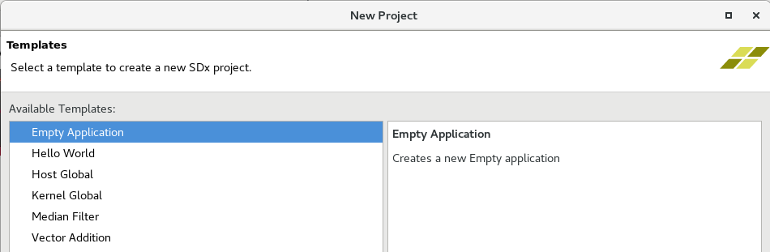
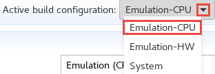

# Optimization Lab

## Introduction

This lab guides you through the steps involved in creating a project and adding a kernel function. After creating a project you will run CPU and hardware emulations to verify the functionality, analyze various generated reports and then apply optimization techniques both on host and kernel side to improve throughput and data transfer rate.

## Objectives

After completing this lab, you will be able to:

- Add a function as a kernel
- Analyze and understand various generated reports
- Optimize kernel code to improve throughput
- Optimize host code to improve data transfer rate
- Verify functionality in hardware on F1

## Procedure

This lab is separated into steps that consist of general overview statements that provide information on the detailed instructions that follow. Follow these detailed instructions to progress through the lab.

This lab comprises six primary steps: You will create an SDAccel project, add a kernel function and perform CPU emulation to validate application, then perform HW emulation to see how much acceleration is possible. You will then optimize the kernel code to reduce the latency and improve the initiation interval followed by optimizing the code to improve data transfer rate. Next you will download the bitstream on F1 and validate application execution. The Appendix section lists steps involved in building the full hardware.

## Step 1: Create an SDAccel Project
### 1.1. Source the SDAccel settings and create a directory called optimization\_lab under _~/aws-fpga_. Change the directory to the newly created directory.
**1.1.1.** Execute the following commands in a terminal window to source the required Xilinx tools:

   ```
      cd ~/aws-fpga		  
      source sdaccel_setup.sh		  
      source $XILINX_SDX/settings64.sh	  
   ```
**1.1.2.** Execute the following commands in a terminal window to create a working directory:

   ```
      mkdir optimization_flow	  
      cd optimization_flow
   ```

### 1.2. Launch SDx, create a workspace in the current directory and create a project, called _optimization\_lab\_example_, using the _Empty Application_ template.
**1.2.1.** Launch SDAccel by executing **sdx** in the terminal window

An Eclipse launcher widow will appear asking to select a directory as workspace

**1.2.2.** Click on the **Browse…** button, browse to **/home/centos/src/project_data/aws-fpga/optimization\_lab** , click **OK** twice

#### Figure 1. Selecting a workspace

The Xilinx SDx IDE window will be displayed


#### Figure 2. The SDx IDE window

**1.2.3.** Click on the **Add Custom Platform** link on the _Welcome_ page

**1.2.4.** Click on the **Add Custom Platform** button, browse to **/home/centos/aws-fpga/SDAccel/aws\_platfom/xilinx\_aws-vu9p-f1\_dynamic\_5\_0** , and click **OK**


#### Figure 3. Hardware platform selected

**1.2.5.** Click **Apply** and then click **OK**

**1.2.6.** Click on the **Create SDx Project** link on the _Welcome_ page

**1.2.7.** In the _New Project_&#39;s page enter **optimization\_lab\_example** in the _Project name:_ field and click **Next** 

Note the AWS-VU9P-F1 board is displayed as the hardware platform

**1.2.8.** Click **Next**

**1.2.9.** Click **Next** with Linux on x86 as the System Configuration and OpenCL as the Runtime options

**1.2.10.** Select **Empty Application** from the _Available Templates_ pane and click **Finish**


#### Figure 4. Selecting an application template

The project IDE will be displayed with six main windows: Project Explorer, Project Settings, Reports, Outline, multi-tab console, and Emulation Console.


#### Figure 5. Project IDE

### 1.3. Import the provided two source files from the /home/centos/sources/optimization\_lab folder to the project
**1.3.1.** Right-click on the **src** folder in the _Project Explorer_ and select **Import…**

**1.3.2.** Select **General &gt; File System** , click **Next** , and browse to the source directory at **/home/centos/sources/optimization\_lab** and click **OK**

**1.3.3.** Select the **idct.cpp** and **krnl\_idct.cpp** files

**1.3.4.** Click **Finish**

**1.3.5.** Expand the **src** folder in the _Project Explorer_ and note the two added files
## Step 2: Add Kernel and Perform CPU Emulation
### 2.1. Select the function(s) that needs to be accelerated.

**2.1.1.** Click on the _Add Hardware Function_ button icon () in the **Hardware Functions** tab to see possible functions which may be accelerated

**2.1.2.** Select _kernl\_idct_ function and click **OK**


#### Figure 6. Selecting a kernel function

**2.1.3.** Notice the **binary\_container\_1** folder is created under which _kml\_idct_ function is added
### 2.2. Analyze the source files
**2.2.1.** Open the **krnl\_idct.cpp** file

**2.2.2.** Locate the **Outline** viewer corresponds to a function in the selected source file. This view provides a convenient way of looking up and navigating the code hierarchy. Each green dot in the **Outline** viewer corresponds to a function in the selected source file


#### Figure 7. Outline view

**2.2.3.** In the _Outline_ viewer, click **idct** to look up the function

The idct function is the core algorithm implemented in the custom hardware accelerator. It is a computationally intensive function that can be highly parallelized on the FPGA, providing significant acceleration over a CPU-based implementation

Review other functions of the accelerator.

- **krnl\_idct** : This is the top-level for the custom hardware accelerator. Interface properties for the accelerator are specified in this function
- **krnl\_idct\_dataflow** : This function is called by the **krnl\_idct** function and encapsulates the main functions of the accelerator
- **read\_blocks** : This function reads from global memory values sent by the host application and streams them to the **execute** function
- **execute** : This function receives the streaming data and, for each 8x8 block received, calls the **idct** function to perform the actual computation and streams the results back out
- **write\_blocks** : This function receives the streaming results from the **execute** function and writes them back to global memory for the host application

**2.2.4.** Open the **idct.cpp** file

**2.2.5.** Again use the _Outline_ viewer to quickly look up and inspect the important functions of the host application:

- **main** : Initializes the test vectors, sets-up OpenCL resources, runs the reference model, runs the hardware accelerator, releases the OpenCL resources, and compares the results of the reference IDCT model with the accelerator implementation
- **runFPGA** : This function takes in a vector of inputs and, for each 8x8 block, calls the hardware accelerated IDCT using the **write** , **run** , **read** , and **finish** helper functions. These function use OpenCL API calls to communicate with the FPGA
- **runCPU** : This function takes in a vector of inputs and, for each 8x8 block, calls **idctSoft** , a reference implementation of the IDCT
- **idctSoft** : This function is the reference software implementation of the IDCT algorithm, used in this example to check the results coming back from the FPGA
- **oclDct** : This class is used to encapsulate the OpenCL runtime calls to interact with the kernel in the FPGA
- **aligned\_allocator** , **smalloc** , **load\_file\_to\_memory** , **getBinaryName** : These are small helper functions used during test vector generation and OpenCL setup

**2.2.6.** Go to line near line no. 580 of the **idct.cpp** file by pressing Ctrl+l (small L) and entering 580

This section of code is where the OpenCL environment is setup in the host application. It is typical of most SDAccel application and will look very familiar to developers with prior OpenCL experience. This body of code can often be reused as-is from project to project.

To setup the OpenCL environment, the following API calls are made:

- **clGetPlatformIDs** : This function queries the system to identify the any available OpenCL platforms. It is called twice as it first extracts the number of platforms before extracting the actual supported platforms
- **clGetPlatformInfo** : Get specific information about the OpenCL platform, such as vendor name and platform name
- **clGetDeviceIDs** : Obtain list of devices available on a platform
- **clCreateContext** : Creates an OpenCL context, which manages the runtime objects
- **clGetDeviceInfo** : Get information about an OpenCL device like the device name
- **clCreateProgramWithBinary** : Creates a program object for a context, and loads specified binary data into the program object. The actual program is obtained before this call through the load\_file\_to memory function
- **clCreateKernel** : Creates a kernel object
- **clCreateCommandQueue** : Create a command-queue on a specific device

Note: all objects accessed through a **clCreate..**. function call should be released before terminating the program by calling **clRelease...**. This avoids memory leakage and clears the locks on the device

### 2.3. Set the XOCC Kernel Linker flags

#### In the idct.cpp file, locate lines 308-310 and note that there are two DDR banks (BANK0 and BANK1) are being used. By default, the compiler will connect all m\_axi ports to DDR BANK0. In order to instruct the compiler that BANK1 is available, the XOCC Kernel Linker flag has to be added. Add --sp krnl_idct_1.m_axi_gmem:bank0 --sp krnl_idct_1.m_axi_gmem1:bank0 --sp krnl_idct_1.m_axi_gmem2:bank1 in the linker flag field

**2.3.1.** In the Project Explorer pane, right-click the project **optimization\_lab\_example** and select the **C/C++ Settings**

**2.3.2.** Select **C/C++ Build** &gt; **Settings** in the left pane

**2.3.3.** Select the **Miscellaneous** under **SDx XOCC Kernel Linker**

**2.3.4.** Using the gedit editor, open the file **xocc\_linker\_flag.txt** from the **/home/centos/sources/optimization\_lab/** directory, copy all the text and paste it in the **Other flags** field


#### Figure 8. Adding the XOCC Kernel Linker flag

**2.3.5.** Click **OK**
### 2.4. Build and run software emulation (Emulation-CPU)
**2.4.1.** Make sure the **project.sdx** under _Optimization\_lab\_example_ in the **Project Explorer** tab is selected

**2.4.2.** Either select **Project &gt; Build Configurations &gt; Set Active &gt; Emulation-CPU** or click on the drop-down button of _Active build configuration_ and select **Emulation-CPU**


#### Figure 9. Selecting CPU emulation build configuration

**2.4.3.** Either select **Project &gt; Build Project** or click on the () button

This will build the project including Optimization\_lab\_example.exe file under the Emulation-CPU directory

**2.4.4.** In the Project Explorer pane, right-click the project **optimization\_lab\_example** and select **Run As** &gt; **Run Configurations…**

**2.4.5.** Select the **Arguments** tab

**2.4.6.** Click on the **Automatically add binary container(s) to arguments** check box

This will add **../binary\_container\_1.xclbin**

**2.4.7.** Click **Apply** and then **Run**

The application will be run and the output will be displayed in the Console tab


#### Figure 10. CPU Emulation run output

### 2.5. Review the software emulation reports
**2.5.1.** In the **Reports** tab, expand **optimization\_lab\_example** &gt; **Emulation-CPU (sw\_emu)** &gt; **optimization\_lab\_example-Default**

There will be two files generated by the tool after running the software emulation: Profile Summary and Application Timeline


#### Figure 11. Generated reports

**2.5.2.** Double-click the **Profile Summary** report and review it

This report provides data related to how the application runs. Notice that the report has four tabs at the top: **Top Operations** , **Kernels &amp; Compute Units** , **Data Transfers** , and **OpenCL APIs**.


#### Figure 12. The Profile Summary report

Click the each tab and review the report:

- **Top Operations** : Shows all the major top operations of memory transfer between the host and kernel to global memory, and kernel execution. This allows you to identify throughput bottlenecks when transferring data. Efficient transfer of data to the kernel/host allows for faster execution times
- **Kernels &amp; Compute Units** : Shows the number of times the kernel was executed. Includes the total, minimum, average, and maximum run times. If the design has multiple compute units, it will show each compute unit&#39;s utilization. When accelerating an algorithm, the faster the kernel executes, the higher the throughput which can be achieved. It is best to optimize the kernel to be as fast as it can be with the data it requires
- **Data Transfers** : This tab has no bearing in software emulation as no actual data transfers are emulated across the host to the platform. In hardware emulation, this shows the throughput and bandwidth of the read/writes to the global memory that the host and kernel share
- **OpenCL APIs** : Shows all the OpenCL API command executions, how many time each was executed, and how long they take to execute

**2.5.3.** Double-click the **Application Timeline** report and review it


#### Figure 13. The Application Timeline

The **Application Timeline** collects and displays host and device events on a common timeline to help you understand and visualize the overall health and performance of your systems. These events include OpenCL API calls from the host code: when they happen and how long each of them takes.

## Step 3: Perform HW Emulation      
### 3.1. Select the Emulation-HW build configuration, and build the project.
**3.1.1.** Either select **Project &gt; Build Configurations &gt; Set Active &gt; Emulation-HW** or click on the drop-down button of _Active build configuration_ and select **Emulation-HW**


#### Figure 14. Selecting HW emulation build configuration

**3.1.2.** Set the XOCC Kernel Linker flag as done in Step 2-3 above

**3.1.3.** Either select **Project &gt; Build Project** or click on the () button

This will build the project including Optimization\_lab\_example.exe file under the Emulation-HW directory

**3.1.4.** Select **Run &gt; Run Configurations…** to open the configurations window

**3.1.5.** Click on the **Arguments** tab and notice that the _binary\_container\_1.xclbin_ is already assigned

If no argument was assigned then you would have to explicitly assign the **xclbin** by clicking on the _Automatically add binary container(s) to arguments_, and click **Apply**

**3.1.6.** Click **Run** to run the application

**3.1.7.** The Console tab shows that the test was completed successfully along with the data transfer rate


#### Figure 15. Hardware emulation run output

### 3.2. Understand the HLS Report, profile summary, and Application Timeline.
**3.2.1.** In the **Reports** tab, expand **optimization\_lab\_example** &gt; **Emulation-HW** &gt; **optimization\_lab\_example-Default**

**3.2.2.** Double-click the **Profile Summary** report and review it


#### Figure 16. HW-Emulation Profile Summary report

**3.2.3.** Review the **Profile Rule Checks** section at the bottom of the **Profile Summary**

- **Profile Rule Checks** (PRCs) interpret profiling results and suggest areas for performance improvements
- PRCs compare profiling results to threshold values. If a check does not meet the threshold value, the right hand column provides suggestions on how to improve performance
- PRCs work for both hardware emulation and system runs on the FPGA

**3.2.4.** Click on the **Kernels &amp; Compute Units** tab of the Profile Summary report

**3.2.5.** Review the Kernel **Total Time (ms)**

This number will serve as a baseline (reference point) to compare against after optimization.


#### Figure 17. HW-Emulation Kernels &amp; Compute Units report

**3.2.6.** In the **Reports** tab, expand **optimization\_lab\_example** &gt; **Emulation-HW** &gt; **binary\_container\_1** &gt; **krnl\_idct**

**3.2.7.** Double-click the **HLS Report** and review it


#### Figure 18. HLS report before optimization

**3.2.8.** In the **Performance Estimates** section, expand the **Latency (clock cycles)** &gt; **Summary** and note the following numbers:

- Latency (min/max):
- Interval (min/max):

The numbers will serve as a baseline for comparison against optimized versions of the kernel

**3.2.9.** In the HLS report, expand **Latency (clock cycles)** &gt; **Detail** &gt; **Instance**

- Note that the 3 sub-functions read, execute and write have roughly the same latency and that their sum total is equivalent to the total Interval reported in the Summary table
- This indicates that the three sub-functions are executing sequentially, hinting to an optimization opportunity

**3.2.10.** Close all the reports

## Step 4. Optimizing the Kernel Code
### 4.1. Analyze the kernel code and apply the DATAFLOW directive.
**4.1.1.** Open the **src > krnl\_idct.cpp** file

**4.1.2.** Using the **Outline** viewer, navigate to the **krnl\_idct\_dataflow** function

Observe that the three functions are communicating using **hls::streams** objects. These objects model a FIFO-based communication scheme. This is the recommended coding style which should be used whenever possible to exhibit streaming behavior and allow **DATAFLOW** optimization

**4.1.3.** Enable the DATAFLOW optimization by uncommenting the **#pragma HLS DATAFLOW** present in the krnl\_idct\_dataflow function (line 322)

- The DATAFLOW optimization allows each of the subsequent functions to execute as independent processes
- This results in overlapping and pipelined execution of the read, execute and write functions instead of sequential execution
- The FIFO channels between the different processes do not need to buffer the complete dataset anymore but can directly stream the data to the next block

**4.1.4.** Comment the three **#pragma HLS stream** statements on lines 327, 328 and 329

**4.1.5.** Save the file
### 4.2. Build the project in Hardware emulation configuration.
**4.2.1.** Make sure the active configuration is **Emulation-HW**

**4.2.2.** Click on the Build button () to build the project
### 4.3. Analyze the HLS report.
**4.3.1.** In the **Reports** tab, expand **optimization\_lab\_example** &gt; **Emulation-HW (hw\_emu)** &gt; **binary\_container\_1**  &gt;   **krnl\_idct**

**4.3.2.** Click the **HLS Report** and review it


#### Figure 19. HLS report after applying pragma DATAFLOW

**4.3.3.** In the **Performance Estimates** section, expand the **Latency (clock cycles)** &gt; **Summary** and note the following numbers:

- Latency (min/max):
- Interval (min/max):

### 4.4. Run the Hardware Emulation.

**4.4.1.** Run the application by clicking the Run button ()

Wait for the run to finish with RUN COMPLETE message

**4.4.2.** In the **Reports** tab, expand **optimization\_lab\_example** &gt; **Emulation-HW (hw\_emu)** &gt; **optimization\_lab\_example**  and double-click the **Profile Summary** report

**4.4.3.** Select the **Kernels &amp; Compute Units** tab.

Compare the **Kernel Total Time (ms)** with the results from the un-optimized run


#### Figure 20. Total execution time of 0.029 compared to 0.046 of un-optimized

## Step 5: Optimizing the Host Code
### 5.1. Analyze the host code.
**5.1.1.** Open the **src > idct.cpp** file

**5.1.2.** Using the **Outline** viewer, navigate to the **runFPGA** function

For each block of 8x8 values, the **runFPGA** function writes data to the FPGA, runs the kernel, and reads results back

Communication with the FPGA is handled by the OpenCL API calls made within the cu.write, cu.run and cu.read functions

- **clEnqueueMigrateMemObjects** schedules the transfer of data to or from the FPGA
- **clEnqueueTask** schedules the executing of the kernel

These OpenCL functions use events to signal their completion and synchronize execution

**5.1.3.** Open the **Application Timeline** of the _Emulation-HW_ run

The green segments at the bottom indicate when the IDCT kernel is running


#### Figure 21. Application Timeline before host code optimization

**5.1.4.** Notice that there are gaps between each of the green segments indicating that the operations are not overlapping

**5.1.5.** Zoom in by performing a left mouse drag across one of these gaps to get a more detailed view

- The two green segments correspond to two consecutive invocations of the IDCT kernel
- The gap between the two segments is indicative of the kernel idle time between these two invocations
- The **Data Transfer** section of the timeline shows that **Read** and **Write** operations are happening when the kernel is idle
- The Read operation is to retrieve the results from the execution which just finished and the Write operation is to send inputs for the next execution
- This represents a sequential execution flow of each iteration

**5.1.6.** Close the **Application Timeline**

**5.1.7.** In the **idct.cpp** file, go to the **oclDct::write** function

- Observe that on line 353, the function synchronizes on the **outEvVec** event through a call to **clWaitForEvents**
- This event is generated by the completion of the **clEnqueueMigrateMemObjects** call in the **oclDct::read** function (line 429)
- Effectively the next execution of the **oclDct::write** function is gated by the completion of the previous **oclDct::read** function, resulting in the sequential behavior observed in the **Application Timeline**

**5.1.8.** Use the **Outline** viewer to locate the definition of the **NUM\_SCHED** macro in the **idct.cpp** file

- This macro defines the depth of the event queue
- The value of 1 explains the observed behavior: new tasks (write, run, read) are only enqueued when the previous has completed effectively synchronizing each loop iteration
- By increasing the value of the **NUM\_SCHED** macro, we increase the depth of the event queue and enable more blocks to be enqueued for processing, which may result in the write, run and read tasks to overlap and allow the kernel to execute continuously or at least more frequently
- This technique is called software pipelining

**5.1.9.** Modify line 213 to increase the value of **NUM\_SCHED** to 6 as follows

**#define NUM\_SCHED 6**

**5.1.10.** Save the file
### 5.2. Run the Hardware Emulation.
**5.2.1.** Run the application by clicking the Run button ()

- Since only the idct.cpp file was changed, the incremental makefile rebuilds only the host code before running emulation
- This results in a much faster iteration loop since it is usually the compilation of the kernel to hardware which takes the most time

**5.2.2.** In the **Reports** tab, expand **optimization\_lab\_example** &gt; **Emulation-HW (hw\_emu)** &gt; **optimization\_lab\_example-Default**

**5.2.3.** Double-click the **Application Timeline** report

Observe how **software pipelining** enables overlapping of data transfers and kernel execution.


#### Figure 22. Application Timeline after the host code optimization

Note: system tasks might slow down communication between the application and the hardware simulation, impacting on the measured performance results. The effect of software pipelining is considerably higher when running on the actual hardware

## Step 6: Run the Application on F1
### 6.1. Since the System build and AFI availability takes considerable amount of time, a precompiled version is provided. Use the precompiled solution directory to verify the functionality.
**6.1.1.** Change to the solution directory by executing the following command

   ```
      cd /home/centos/sources/optimization_lab_solution
   ```
**6.1.2.** Run the following commands to load the AFI and execute the application to verify the functionality

   ```
      sudo sh
      source /opt/Xilinx/SDx/2017.4.rte.dyn/setup.sh
      ./optimization_lab_example.exe xclbin/binary_container_1.awsxclbin
   ```
**6.1.3.** The FPGA bitstream will be downloaded and the host application will be executed showing output something like:


#### Figure 23. Execution output

**6.1.4.** Enter **exit** in the teminal window to exit out of the sudo shell

**6.1.5.** Close the SDx by selecting **File &gt; Exit**

## Conclusion

In this lab, you used SDAccel IDE to create a project and added a kernel function. After identifying the kernel you performed CPU and hardware emulations. You analyzed various generated reports and then you optimized kernel code using DATAFLOW and host code by increasing the number of read, write, and run tasks to improve throughput and data transfer rates. You then validated the functionality on F1.

---------------------------------------

<p align="center"><b>
Start the next lab: <a href="rtl_kernel_wizard_lab.md">5. RTL-Kernel Wizard Lab</a>
</b></p>

---------------------------------------


## Appendix Build Full Hardware 
### A.1. Set the build configuration to System and build the system (Note that since the building of the project takes over two hours skip this step in the workshop environment and move to next step).
**A.1.1.** Either select **Project &gt; Build Configurations &gt; Set Active &gt; System** or click on the drop-down button of _Active build configuration_ and select **System**

**A.1.2.** Set the XOCC Kernel Linker flag as done in Step 2-3 above

**A.1.3.** Either select **Project &gt; Build Project** or click on the () button

This will build the project under the **System** directory. The built project will include optimization\_lab\_example.exe file along with binary\_container\_1.xclbin file

This step takes about two hours

### A.2. Create an Amazon FPGA Image (AFI)

To execute the application on F1, the following files are needed:

- Host application
- FPGA binary (xclbin)
- Amazon FPGA Image (awsxclbin)

The xclbin and the host applications are already generated by the System configuration step

**A.2.1.** Create a **xclbin** directory under the _optimization\_lab_ directory using the following commands

   ```
      cd /home/centos/aws-fpga/optimization_lab
      mkdir xclbin
   ```

**A.2.2.** Copy the generated **xclbin** file ( **binary\_container\_1.xclbin** ) and the host application (gui\_kernel\_example.exe) from the **System** folder into the created **xclbin** directory, using the following commands

   ```
      cd xclbin
      cp /home/centos/aws-fpga/optimization_lab/optimization_lab_example/System/binary_container_1.xclbin .
      cp /home/centos/aws-fpga/optimization_lab/optimization_lab_example/System/optimization_lab_example.exe .
   ```

### A.3. Create an AFI by running the create\_sdaccel\_afi.sh script and wait for the completion of the AFI creation process
**A.3.1.** Enter the following command to generate the AFI:

   ```
      $SDACCEL_DIR/tools/create_sdaccel_afi.sh –xclbin=binary_container_1.xclbin –s3_bucket=<bucket-name> -s3_dcp_key=<dcp-folder-name> -s3_logs_key=<logs-folder-name>
   ```

In the above command, &lt;bucket-name&gt;, &lt;dcp-folder-name&gt;, and &lt;logs-folder-name&gt; are the names you would have given when running CLI script.  In the workshop environment this was already done.

The create\_sdaccel\_afi.sh script does the following:

- Starts a background process to create the AFI
- Generates a \_afi\_id.txt which contains the FPGA Image Identifier (or AFI ID) and Global FPGA Image Identifier (or AGFI ID) of the generated AFIs
- Creates the \*.awsxclbin AWS FPGA binary file which will need to be read by the host application to determine which AFI should be loaded in the FPGA.

**A.3.2.** Enter the following command to note the values of the AFI IDs by opening the *\_afi\_id.txt file.
   ```
      cat *afi_id.txt
   ```
**A.3.3.** Enter the **describe-fpga-images** API command to check the status of the AFI generation process:

   ```
      aws ec2 describe-fpga-images --fpga-image-ids <AFI ID>
   ```
Note: When AFI creation completes successfully, the output should contain:

   ```
      ...
      "State": {
          "Code": "available"
      },
      
      ...
   ```
**A.3.4.** Wait until the AFI becomes available before proceeding to execute on the F1 instance.
