# Hardware/Software Debugging

## Introduction

This lab is continuation of the previous (**<a href="rtl_kernel_wizard_lab.md">RTL-Kernel Wizard Lab</a>**) lab. You will add ChipScope cores to monitor the acitivities taking place at the kernel interface level and perform software debugging using SDx debug capabilities.

## Objectives

After completing this lab, you will be able to:

- Add ChipScope cores at the kernel interface level 
- Debug software application
- Verify functionality in hardware on F1

## Steps
### Open an SDAccel Project
1. Execute the following commands, if not already done, in a terminal window to source the required environment settings:
   ```
      cd ~/aws-fpga
      source sdaccel_setup.sh
      source $XILINX_SDX/settings64.sh
   ```
1. Execute the following commands in a terminal window to change to a working directory where the pre-compiled project is provided:  
   ```
      cd /home/centos/sources/debug_lab
   ```
1. Since we will be executing application in System configuration mode, we need to start the SDx program as being **su**. Execute the following commands to launch **sdx**
   ```
      sudo sh
      source /opt/xilinx/xrt/setup.sh
      /opt/Xilinx/SDx/2018.2.op2258646/bin/sdx
   ```  
1. An Eclipse launcher window will appear asking you to select a directory as workspace. Click on the **Browse…** button, browse to **/home/centos/sources/debug\_lab**, click **OK** twice

### Hardware Debugging
#### Review the Appendix section to understand how to add ChipScope Debug bridge core. It is already added in the pre-compiled design
#### Run the application
1. In the **Assistant** tab, expand **System > Run** and select **Run Configuration**
1. Make sure that the Arguments tab shows **../binary_container_1.xclbin** entry
1. Make sure that the Environment tab shows **/opt/xilinx/xrt/lib** in the _LD\_LIBRARY\_PATH_ field
1. Click **Run**
The host application will start executing, loading bitstream, and pausing for the user input as coded on line 246
    <p align="center">
    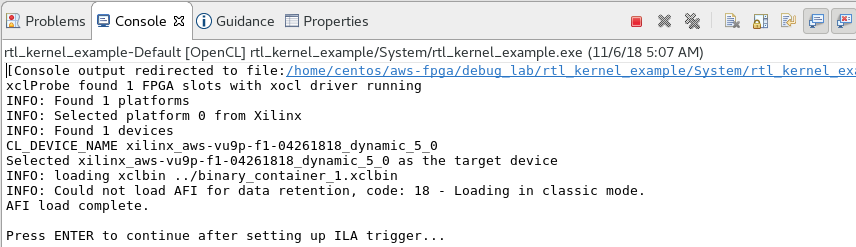
    </p>
    <p align = "center">
    <i>Paused execution</i>
    </p>
### Start Vivado Hardware Manager
1. In another terminal window, start virtual jtag connection using following two commands. The Virtual JTAG XVC Server will start listining to TCP port 10201
   ```
      source $XILINX_SDX/settings64.sh
      sudo fpga-start-virtual-jtag -P 10201 -S 0
   ```
    <p align="center">
    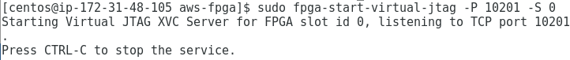
    </p>
    <p align = "center">
    <i>Paused execution</i>
    </p>
1. Start Vivado from another terminal window from the debug_lab directory
1. Click on **Open Hardware Manager** link
1. Click **Open Target > Open New Target**
1. Click **Next**
1. Click **Next** keeping default _Local Server_ option
1. Click on the **Add Xilinx Virtual Cable (XVC)** button
1. Enter **localhost** in the _Host name_ and **10201** in the _Port_ fields, and click **OK**
    <p align="center">
    
    </p>
    <p align = "center">
    <i>Adding Virtual JTAG cable</i>
    </p>
    The Open New Hardware Target form with scanned debug_bridge will appear
     <p align="center">
    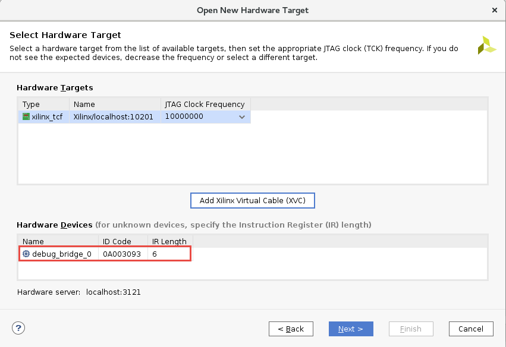
    </p>
    <p align = "center">
    <i>Scanned debug bridge</i>
    </p>  
1. Click **Next** and then **Finish**  
The Vivado Hardware Manager will open showing _Hardware_, _Waveform_, _Settings-hw_, _Trigger-Setup_ windows. The _Hardware_ window also shows two ILA cores inserted in the design
     <p align="center">
    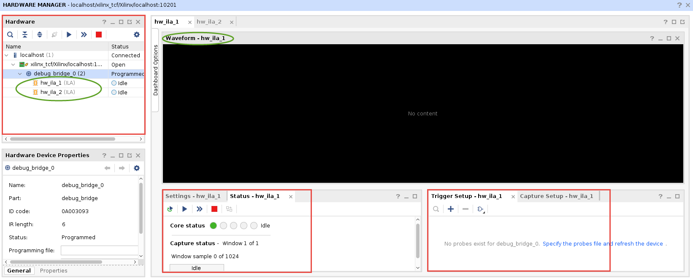
    </p>
    <p align = "center">
    <i>Hardware Manager</i>
    </p>  
1. In the _Hardware Device Properties_ view, click on browse button of the **Probes file**, browse to **/home/centos/sources/debug_lab/rtl_kernel_example/System** folder, select **top_sp.ltx** entry and click **OK**  
Notice four (Slot_0 to Slot_3) probes are filled in the Waveform window
1. Click on the _Run Trigger immediate_ button and observe the waveform window is filled indicating the four channels are in _Inactive_ state
     <p align="center">
    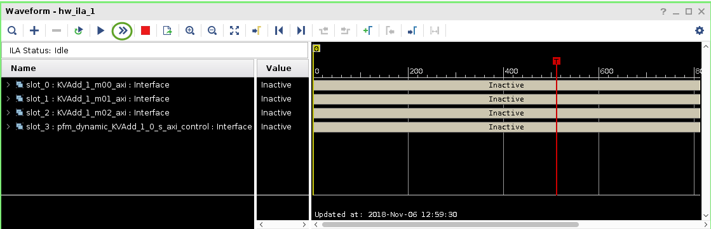
    </p>
    <p align = "center">
    <i>Forced triggered waveform window</i>
    </p>  
1. Expand **slot_1 : KVAdd_1_m01_axi : W Channel** in the Waveform window, select the **WVALID** signal and drag it to the Trigger Setup - hw window
     <p align="center">
    
    </p>
    <p align = "center">
    <i>Adding a probe in the Trigger Setup window</i>
    </p>  
1. Click on drop-down button of the Value field and select trigger condition value as 1
     <p align="center">
    
    </p>
    <p align = "center">
    <i>Setting trigger condition</i>
    </p>  
1. Click on the Run button and observe hw_ila_1 probe is waiting for the trigger condition to occur
     <p align="center">
    
    </p>
    <p align = "center">
    <i>Waiting for the trigger condition to occur</i>
    </p>  
1. Switch to the SDx window and hit Enter key in the Console window for the program to continue execution  
Observe that the program finishes execution displaying **INFO: Test completed successfully** message in the Console window
1. Switch back to Vivado and observed that since the trigger condition is met, the waveform window is displaying activities
     <p align="center">
    
    </p>
    <p align = "center">
    <i>Triggered waveform</i>
    </p>  
1. Expand **Slot_0, slot_1,** and **slot_2** groups, zoom in region of about _450 to 1000_, and observe the data transfer taking place on each channels. Also note the addresses from where data are read and results are written into  
    <p align="center">
    
    </p>
    <p align = "center">
    <i>Zoomed view showing various activities</i>
    </p>  
1. Zoom in on one of the data beats and hover your mouse at each successive samples and notice the data content changing
1. Close Vivado by selecting **File > Exit**
1. Close the jtag probe by switching to its terminal window and pressing _Ctrl-C_

### Perform Software Debugging
1. Switch to the SDx GUI
1. Comment out lines 246 and 247
1. Save the file by typing **Ctrl-S**
1. In the **Assistant** tab, right-click on **System > Debug** and select **Debug Configuration**
1. Make sure that the **Arguments** tab shows **../binary_container_1.xclbin** entry
1. Make sure that the Environment tab shows **/opt/xilinx/xrt/lib** in the _LD\_LIBRARY\_PATH_ field
1. Click **Debug**  
The host application will compile since we have modified it and a window will pop-up asking to switch to _Debug perspective_
1. Click **Yes**  
The program will be downloaded and execution will begin, halting at **main()** entry point
1. In the _main.c_ view scroll down to line 280 and double-click on the left border to set a breakpoint  
At this point, three buffers would have been created
    <p align="center">
    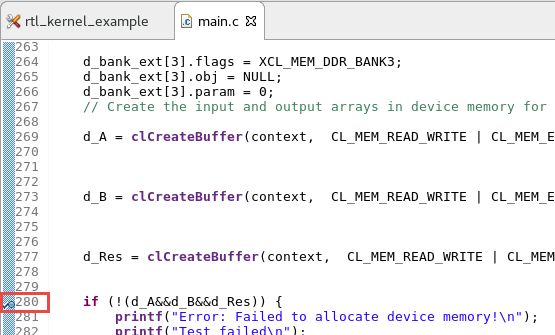
    </p>
    <p align = "center">
    <i>Setting a breakpoint</i>
    </p>  
1. Click on the **Resume** button or press **F8**  
The execution will resume and stop at the breakpoint  
At this point you can go to various tabs and see the contents in the current scope  
Two of the important features of SDx debugging is examining command queues and memory buffers as the program execution progresses
1. Click on the **Step Over** button or press **F6**  
The execution will progress one statement at a time
1. Continue pressing **F6** until you reach line number _344_ at which point kernel would have finished execution
1. Click on the _Suspend : Step_ entry in the **Debug** tab and then select **Memory Buffers** tab  
Notice that three buffers are allocated, their IDs, DDR memory address, and sizes
    <p align="center">
    
    </p>
    <p align = "center">
    <i>Memory buffers allocated</i>
    </p>  
1. Select the **Command Queue** tab and notice that there no commands enqued. Lines 344-348 creates commands to read the data and results
    <p align="center">
    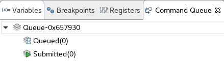
    </p>
    <p align = "center">
    <i>Setting a breakpoint</i>
    </p>  
1. Press **F6** to execute _clEnqueueReadBuffer_ command to create a read buffer command for reading operand _d\_A_  
Notice the Command Queue tab shows one command submitted
    <p align="center">
    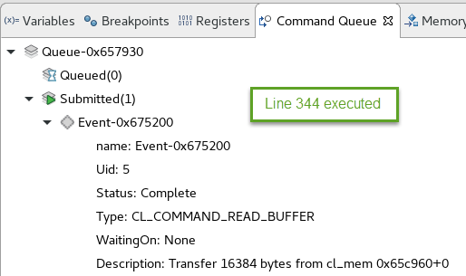
    </p>
    <p align = "center">
    <i>Setting a breakpoint</i>
    </p>  
1. Press **F6** to execute _clEnqueueReadBuffer_ command for reading operand _d\_B_  
Notice the Command Queue tab shows two commands submitted
    <p align="center">
    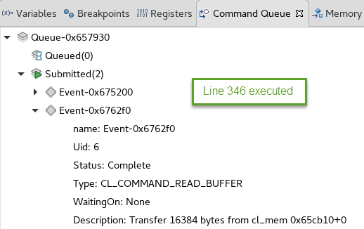
    </p>
    <p align = "center">
    <i>Setting a breakpoint</i>
    </p>  
1. Set a breakpoint at line _397_ and press **F8** to resume the execution  
Notice that the Command Queue tab still shows entries
1. Press **F6** to execute _clReleaseKernel_ command   
Notice the Memory Buffers tab is empty as all memories are released
1. Click **F8** to complete the execution
1. Close the SDx program

## Conclusion

In this lab, you used ChipScope Debug bridge and cores to perform hardware debugging. You also performed software debugging using SDx debug perspective.

## Appendix
### Steps to Add ChipScope Debug core      
1. In the **Assistant** tab, expand **System > binary_container_1 > KVadd**
1. Select **KVAdd**, right-click and select **Settings...**
1. In the **Hardware Function Settings** window, click on the _ChipScope Debug_ option for the _KVAdd_ kernel
    <p align="center">
    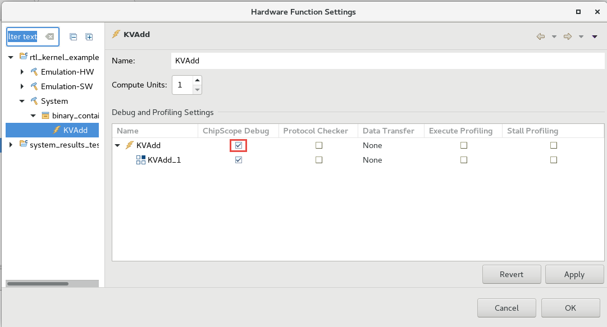
    </p>
    <p align = "center">
    <i>Adding ChipScope Debug module</i>
    </p>
1. Click **Apply** and **OK**
1. In the **Project Explorer** tab, expand **src > sdx_rtl_kernel > KVAdd** and double-click on the **main.c** to open it in the editor window
1. Go to line 246 and enter the following lines of code which will pause the host software execution after creating kernel but before allocating buffer
   ```
      printf("\nPress ENTER to continue after setting up ILA trigger...");
      getc(stdin);
   ```
    <p align="center">
    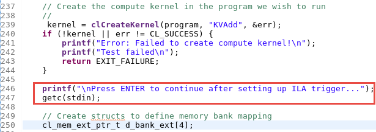
    </p>
    <p align = "center">
    <i>Modifying code to stop its execution before kernel is executed to start Vivado Hardware manager</i>
    </p>


