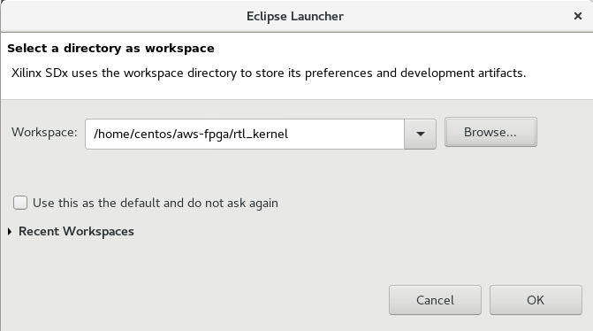
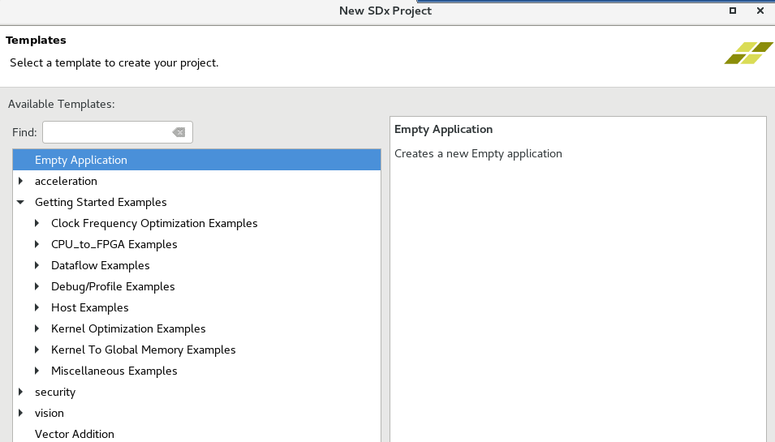

# Using RTL Kernel Wizard

## Introduction

This lab guides you through the steps involved in using a RTL Kernel wizard to wrap a user RTL-based IP so the generated IP can be used in SDAccel project.

## Objectives

After completing this lab, you will be able to:

- Understand how to use the RTL Kernel wizard available in SDAccel 
- Add the created IP in an application
- Verify functionality in hardware on F1

## Procedure

This lab is separated into steps that consist of general overview statements that provide information on the detailed instructions that follow. Follow these detailed instructions to progress through the lab.

This lab comprises three primary steps: You will create an SDAccel project. Use RTL Kernel project creation wizard, perform hardware emulation, and verify the functionality on F1.  The Appendix section lists steps involved in building the full hardware.

## Step 1: Create an SDAccel Project
### 1.1. Source the SDAccel settings and create a directory called rtl\_kernel under _~/aws-fpga_. Change the directory to the newly created directory.
**1.1.1.** Execute the following commands in a terminal window to source the required environment settings:

   ```
      cd ~/aws-fpga
      source sdaccel_setup.sh
      source $XILINX_SDX/settings64.sh
   ```
**1.1.2.** Execute the following commands in a terminal window to create a working directory:

   ```
      mkdir rtl_kernel
      cd rtl_kernel
   ```

### 1.2. Launch SDx, create a workspace and create a project, called _rtl\_kernel_, using the _Empty Application_ template.
**1.2.1.** Launch SDAccel by executing **sdx** in the terminal window

An Eclipse launcher widow will appear asking to select a directory as workspace

**1.2.2.** Click on the **Browse…** button, browse to **/home/centos/aws-fpga/rtl\_kernel** , click **OK** twice


#### Figure 1. Selecting a workspace

**1.2.3.** Click on the **Add Custom Platform** link on the _Welcome_ page

**1.2.4.** Click on the **Add Custom Platform** button, browse to **/home/centos/aws-fpga/SDAccel/aws\_platfom/xilinx\_aws-vu9p-f1\_dynamic\_5\_0**, and click **OK**


#### Figure 2. Hardware platform selected

**1.2.5.** Click **Apply** and then click **OK**

**1.2.6.** Click on the **Create SDx Project** link on the _Welcome_ page

**1.2.7.** In the _New Project_&#39;s page enter **rtl\_kernel\_example** in the _Project name:_ field and click **Next**

Note the AWS-VU9P-F1 board is displayed as the hardware platform

**1.2.8.** Click **Next**

**1.2.9.** Click **Next** with Linux on x86 as the System Configuration and OpenCL as the Runtime options

**1.2.10.** Select **Empty Application** from the _Available Templates_ pane and click **Finish**


#### Figure 3. Selecting an application template

## Step 2: Create RTL\_Kernel Project and Perform HW Emulation      
### 2.1. Run the RTL Kernel wizard from the SDAccel project.
**2.1.1.** Make sure the **project.sdx** under _rtl\_kernel\_example_ in the **Project Explorer** tab is selected

**2.1.2.** Select **Xilinx &gt; Create RTL Kernel…**

Note that the Create RTL Kernel Wizard will be invoked displaying the Welcome screen


#### Figure 4. Welcome screen of the RTL Kernel Wizard

**2.1.3.** Click **Next**

**2.1.4.** Change _Kernel_ name to **KVAdd** , (for Kernel Vector Addition), _Kernel vendor_ to **Xilinx** leaving the _Kernel library_ and _Number of clocks_ to the default values


#### Figure 5. Setting general settings including name and number of clocks

**2.1.5.** Click **Next**

**2.1.6.** Click **Next** with _Number of scalar kernel input arguments_ default value being **1** and the _Argument type_ as **unit**


#### Figure 6. Selecting number of scalar arguments

**2.1.7.** We will have three arguments to the kernel (2 input and 1 output) which will be passed through Global Memory. Set _Number of AXI master interfaces_ to be **3**

**2.1.8.** Keep the width of each AXI master data width to **64** (note this is specified in bytes so this will give a width of 512 bits), name **A** as the argument name to m00\_axi, **B** to m01\_axi, and **Res** to m02\_axi


#### Figure 7. Selecting number of AXI master interfaces, their widths, and naming them

**2.1.9.** Click **Next** and the summary page will be displayed showing a function prototype and register map

Note the control register is accessed via S\_AXI\_CONTROL interface and is at offset 0 and the scalar operand is at offset 0x10.  There are three master AXI interfaces being used.


#### Figure 8. Summary of the design interface that will be created by the wizard

**2.1.10.** Click **OK** to close the wizard

Notice that a Vivado Project will be created and opened


#### Figure 9. Vivado project created by the wizard

### 2.2. Analyze the design built by the RTL kernel wizard
**2.2.1.** Expand the hierarchy of the Design Sources in the Sources window and notice all the design sources, constraint file, and the basic testbench generated by the wizard


#### Figure 10. Design hierarchy along with constraints and testbench files

There is one module to handle the control signals ap\_start, ap\_done, and ap\_idle; and three master AXI channels to read source operands from and write the result back to DRAM.

Expanded m02\_axi module shows read, write, fifo\_valid\_pipeline, and an adder modules.

**2.2.2.** Select **Flow Navigator &gt; RTL ANALYSIS &gt; Open Elaborated Design** which will analyze the design and open a schematic view. Click **OK**

**2.2.3.** You should see two top-level blocks: example and control as seen below


#### Figure 11. Top-level modules

**2.2.4.** Double-click on the example block and observe the three hierarchical Master AXI blocks


#### Figure 12. Three master axi modules

**2.2.5.** Zoom in into the top section and see the control logic the wizard has generated to provide ap\_start, ap\_idle, and ap\_done signals


#### Figure 13. Control logic generation

**2.2.6.** Traverse through one of the AXI interface blocks (m02) and observe that the example code it has generated consists of Read Master, Write Master, Read FIFO, Write FIFO, Read FIFO valid pipeline and an Adder


#### Figure 14. A typical master axi hierarchical design generated by the wizard

**2.2.7.** Close the elaborated view by selecting **File &gt; Close Elaborated Design**

**2.2.8.** Click **OK**

**2.2.9.** Select **Flow > Generate RTL Kernel** 

**2.2.10.** Click **OK** using the default option (Sources-only kernel)

The packager will be run, generating the xo file which will be used in the design. The Vivado will close after generating the design

### 2.3. Analyze the created files and added to the SDAccel project after the RTL kernel has been generated.
**2.3.1.** Expand the _src_ folder under the **rtl\_kernel\_example**

Notice that _sdx\_rtl\_kernel\_wizard_ folder and its hierarchy has been added as the source, under which a Vivado project related folders/files are included (name starting with sdx\_rtl\_kernel…) and with wizard created KVAdd\_ex folder.


#### Figure 15. The rtl kernel related files added to the src folder

**2.3.2.** Double-click on the **main.c** and look at its content

The _main_ function is defined on line 60. The number of words it transfers is 4096. Lines 96 to 107 fills the source operands and expected result. Lines 200-244 deals with loading xclbin and creating kernel. Lines 248-266 creates the buffers in the device memory. Lines 319-333 sets arguments, executes the kernel, and waits for it to finish. Lines 346-385 reads the data and compares them. Lines 391-401 releases the memory, program, and kernel.

### 2.4. Add the binary container, select the Emulation-HW build configuration, and build the project.
**2.4.1.** Click on the **Add Binary Container** button ()

Notice the _binary\_container\_1_ is added to the project. Since the design has RTL IP, the binary container does not have further hierarchy


#### Figure 16. Adding binary container to the project

**2.4.2.** Either select **Project &gt; Build Configurations &gt; Set Active &gt; Emulation-HW** or click on the drop-down button of _Active build configuration_ and select **Emulation-HW**


#### Figure 17. Selecting HW emulation build configuration

**2.4.3.** Either select **Project &gt; Build Project** or click on the () button

This will build the project including rtl\_kernel\_example.exe file under the Emulation-HW directory

**2.4.4.** Select **Run &gt; Run Configurations…** to open the configurations window

**2.4.5.** Click on the **Arguments** tab and notice that no binary container is assigned


#### Figure 18. Unpopulated Arguments tab

**2.4.6.** Click on the **Automatically add binary container(s) to arguments** check box, click **Apply** , and the click **Run** to run the application


#### Figure 19. Program argument assigned

**2.4.7.** The Console tab shows that the test was completed successfully along with the data transfer rate


#### Figure 20. Hardware emulation run output

**2.4.8.** Double-click on the **Application Timeline** entry in the _Reports_ tab, expand all entries in the timeline graph, zoom appropriately and observe the transactions


#### Figure 21. Timeline graph showing various activities in various region of the system

## Step 3: Run the Application on F1        
### 3.1. Since the System build and AFI availability takes considerable amount of time, a precompiled version is provided. Use the precompiled solution directory to verify the functionality.
**3.1.1.** Change to the solution directory by executing the following command

   ```
      cd /home/centos/sources/rtl_kernel_solution
   ```
**3.1.2.** Run the following commands to load the AFI and execute the application to verify the functionality

   ```
      sudo sh
      source /opt/Xilinx/SDx/2017.4.rte.dyn/setup.sh
      ./rtl_kernel_example.exe xclbin/binary_container_1.awsxclbin
   ```

**3.1.3.** The FPGA bitstream will be downloaded and the host application will be executed showing output something like:


#### Figure 22. Execution output

**3.1.4.** Enter **exit** in the teminal window to exit out of sudo shell

**3.1.5.** Close the SDx by selecting **File &gt; Exit**

## Conclusion

In this lab, you used the RTL Kernel wizard to create a sample adder application. You saw that the wizard creates an RTL IP with the specified number of AXI master ports. You performed HW emulation and analyzed the application timeline. You finally ran the application on an AWS F1 instance and validated the functionality.

## Appendix: Build Full Hardware 
### A.1. Set the build configuration to System and build the system (Note that since the building of the project takes over two hours skip this step in the workshop environment and move to next step).
**A.1.1.** Either select **Project &gt; Build Configurations &gt; Set Active &gt; System** or click on the drop-down button of _Active build configuration_ and select **System**

**A.1.2.** Either select **Project &gt; Build Project** or click on the () button

This will build the project under the **System** directory. The built project will include rtl\_kernel\_example.exe file along with binary\_container\_1.xclbin file

This step takes about two hours

### A.2. Create an Amazon FPGA Image (AFI)

To execute the application on F1, the following files are needed:

- Host application (exe)
- FPGA binary (xclbin)
- Amazon FPGA Image (awsxclbin)

The xclbin and the host applications are already generated by the System configuration step

**A.2.1.** Create a **xclbin** directory under the _rtl\_kernel\_example_ directory using the following commands:

   ```
      cd /home/centos/aws-fpga/rtl_kernel
      mkdir xclbin
   ```
**A.2.2.** Copy the generated **xclbin** file ( **binary\_container\_1.xclbin** ) and the host application (rtl\_kernel\_example.exe) from the **System** folder into the created **xclbin** directory, using the following commands

   ```
      cd xclbin
      cp /home/centos/aws-fpga/rtl_kernel/rtl_kernel_example/System/binary_container_1.xclbin .
      cp /home/centos/aws-fpga/rtl_kernel/rtl_kernel_example/System/rtl_kernel_example.exe .
   ```
### A.3. Create an AFI by running the create\_sdaccel\_afi.sh script and wait for the completion of the AFI creation process
**A.3.1.** Enter the following command to generate the AFI:

   ```
      $SDACCEL_DIR/tools/create_sdaccel_afi.sh –xclbin=binary_container_1.xclbin –s3_bucket=<bucket-name> -s3_dcp_key=<dcp-folder-name> -s3_logs_key=<logs-folder-name>
   ```
In the above command, &lt;bucket-name&gt;, &lt;dcp-folder-name&gt;, and &lt;logs-folder-name&gt; are the names you would have given when running CLI script.  In the workshop environment this was already done.

The create\_sdaccel\_afi.sh script does the following:

- Starts a background process to create the AFI
- Generates a \_afi\_id.txt which contains the FPGA Image Identifier (or AFI ID) and Global FPGA Image Identifier (or AGFI ID) of the generated AFIs
- Creates the \*.awsxclbin AWS FPGA binary file which will need to be read by the host application to determine which AFI should be loaded in the FPGA.

**A.3.2.** Enter the following command to note the values of the AFI IDs by opening the *\_afi\_id.txt file.

   ```
      cat *afi_id.txt
   ```
**A.3.3.** Enter the **describe-fpga-images** API command to check the status of the AFI generation process:

**aws ec2 describe-fpga-images --fpga-image-ids &lt;AFI ID&gt;**

Note: When AFI creation completes successfully, the output should contain:

   ```
      ...
      "State": {
          "Code": "available"
      },
      
      ...
   ```

**A.3.4.** Wait until the AFI becomes available before proceeding to execute on the F1 instance.

