# Using RTL Kernel Wizard

## Introduction

This lab guides you through the steps involved in using a RTL Kernel wizard to wrap a user RTL-based IP so the generated IP can be used in SDAccel project.

## Objectives

After completing this lab, you will be able to:

- Understand how to use the RTL Kernel wizard available in SDAccel 
- Add the created IP in an application
- Verify functionality in hardware on F1

## Steps
### Create an SDAccel Project
1. Execute the following commands in a terminal window to source the required environment settings:
   ```
      cd ~/aws-fpga
      source sdaccel_setup.sh
      source $XILINX_SDX/settings64.sh
   ```
1. Execute the following commands in a terminal window to create a working directory:  
   ```
      mkdir rtl_kernel
      cd rtl_kernel
   ```
1. Launch SDAccel by executing **sdx** in the terminal window  
An Eclipse launcher window will appear asking to select a directory as workspace
1. Click on the **Browse…** button, browse to **/home/centos/aws-fpga/rtl\_kernel**, click **OK** twice
    <p align="center">
    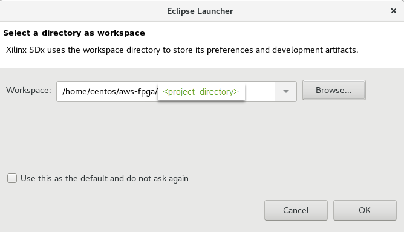
    </p>
    <p align = "center">
    <i>Selecting a workspace</i>
    </p>
    The Xilinx SDx IDE window will be displayed
    <p align="center">
    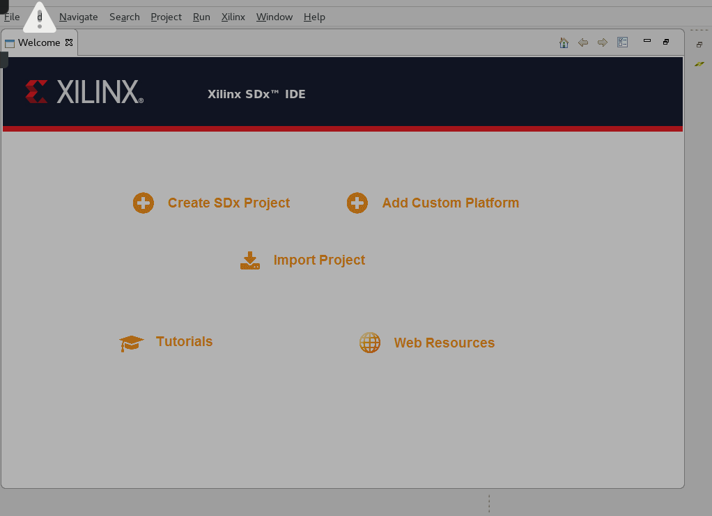
    </p>
    <p align = "center">
    <i>The SDx IDE window</i>
    </p>
1. Click on the **Add Custom Platform** link on the _Welcome_ page
1. Click on the **Add Custom Platform** button, browse to **/home/centos/aws-fpga/SDAccel/aws\_platfom/xilinx\_aws-vu9p-f1-04261818\_dynamic\_5\_0**, and click **OK**
    <p align="center">
    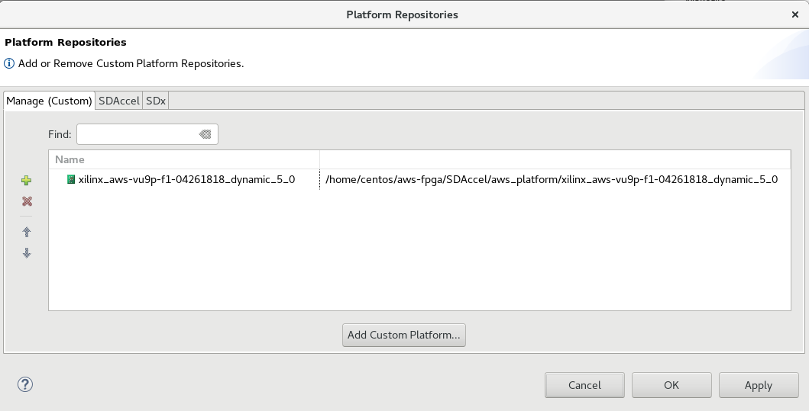
    </p>
    <p align = "center">
    <i>Hardware platform selected</i>
    </p>
1. Click **Apply** and then click **OK**
1. Click on the **Create SDx Project** link on the _Welcome_ page
1. Click **Next** 
1. In the _New Project_&#39;s page enter **rtl\_kernel\_example** in the _Project name:_ field and click **Next**  
Note the aws-vu9p-f1-04261818 board is displayed as the hardware platform
1. Click **Next**
1. Click **Next** with Linux on x86 as the System Configuration and OpenCL as the Runtime options
1. Select **Empty Application** from the _Available Templates_ pane and click **Finish**
    <p align="center">
    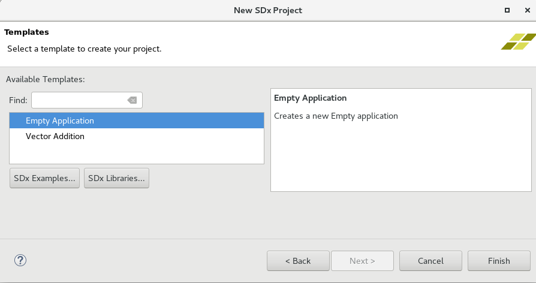
    </p>
    <p align = "center">
    <i>Selecting an application template</i>
    </p>

### Create RTL\_Kernel Project using RTL Kernel Wizard      
1. Make sure the **project.sdx** under _rtl\_kernel\_example_ in the **Project Explorer** tab is selected
1. Select **Xilinx &gt; RTL Kernel Wizard…**  
Note that the Create RTL Kernel Wizard will be invoked displaying the Welcome screen
    <p align="center">
    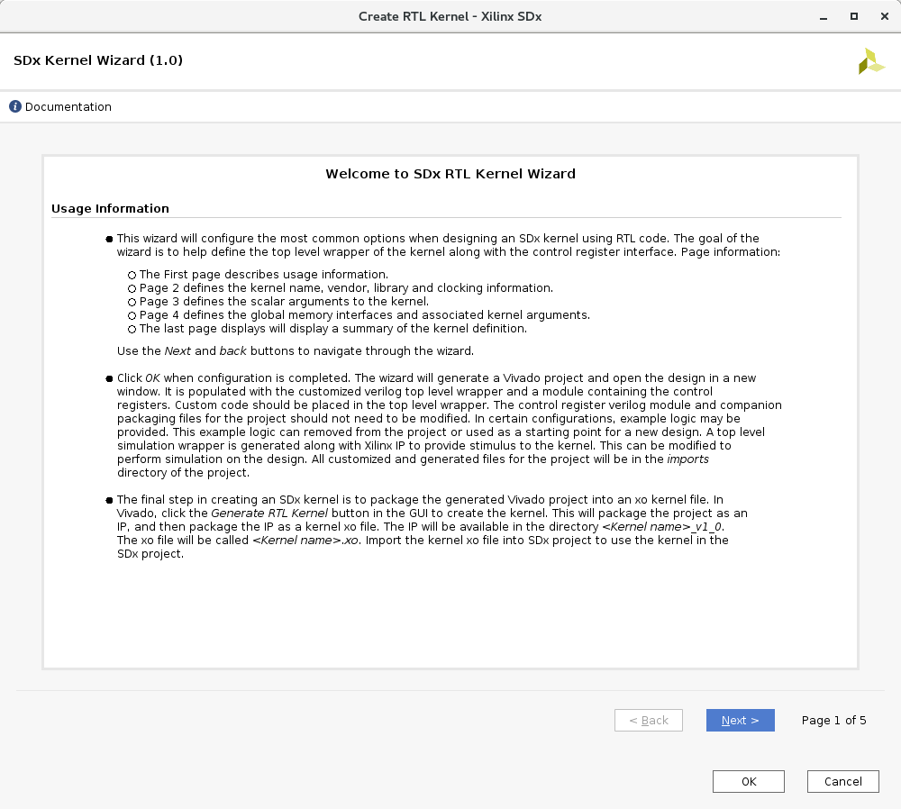
    </p>
    <p align = "center">
    <i>Welcome screen of the RTL Kernel Wizard</i>
    </p>
1. Click **Next**
1. Change _Kernel_ name to **KVAdd**, (for Kernel Vector Addition), _Kernel vendor_ to **Xilinx** leaving the _Kernel library_ and _Number of clocks_ to the default values
    <p align="center">
    
    </p>
    <p align = "center">
    <i>Setting general settings including name and number of clocks</i>
    </p>
1. Click **Next**
1. Click **Next** with _Number of scalar kernel input arguments_ default value being **1** and the _Argument type_ as **unit**
    <p align="center">
    
    </p>
    <p align = "center">
    <i>Selecting number of scalar arguments</i>
    </p>
1. We will have three arguments to the kernel (2 input and 1 output) which will be passed through Global Memory. Set _Number of AXI master interfaces_ to be **3**
1. Keep the width of each AXI master data width to **64** (note this is specified in bytes so this will give a width of 512 bits), name **A** as the argument name to m00\_axi, **B** to m01\_axi, and **Res** to m02\_axi
    <p align="center">
    
    </p>
    <p align = "center">
    <i>Selecting number of AXI master interfaces, their widths, and naming them</i>
    </p>
1. Click **Next** and the summary page will be displayed showing a function prototype and register map  
Note the control register is accessed via S\_AXI\_CONTROL interface and is at offset 0 and the scalar operand is at offset 0x10.  There are three master AXI interfaces being used.
    <p align="center">
    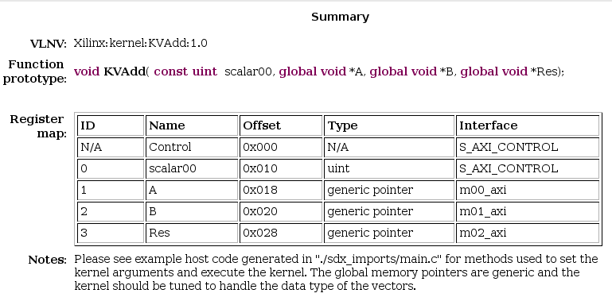
    </p>
    <p align = "center">
    <i>Summary of the design interface that will be created by the wizard</i>
    </p>
1. Click **OK** to close the wizard  
Notice that a Vivado Project will be created and opened
    <p align="center">
    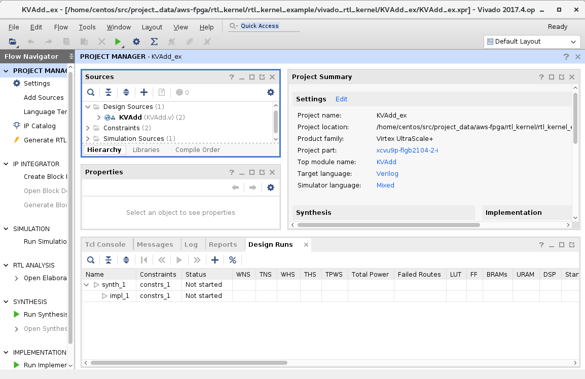
    </p>
    <p align = "center">
    <i>Vivado project created by the wizard</i>
    </p>

### Analyze the design built by the RTL Kernel wizard
1. Expand the hierarchy of the Design Sources in the Sources window and notice all the design sources, constraint file, and the basic testbench generated by the wizard  
    <p align="center">
    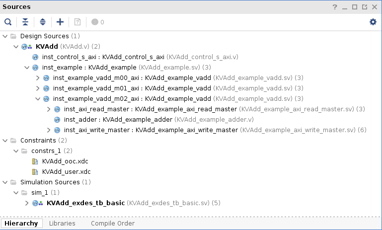
    </p>
    <p align = "center">
    <i>Design hierarchy along with constraints and testbench files</i>
    </p>  
    There is one module to handle the control signals ap\_start, ap\_done, and ap\_idle; and three master AXI channels to read source operands from and write the result back to DDR. Expanded m02\_axi module shows read, write, fifo\_valid\_pipeline, and an adder modules.  
1. Select **Flow Navigator &gt; RTL ANALYSIS &gt; Open Elaborated Design** which will analyze the design and open a schematic view. Click **OK**
1. You should see two top-level blocks: example and control as seen below
    <p align="center">
    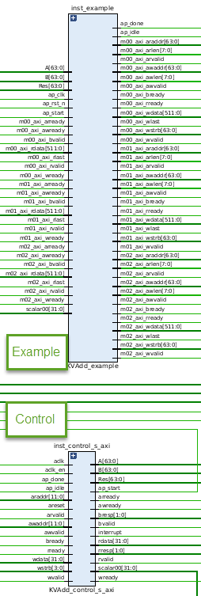
    </p>
    <p align = "center">
    <i>Top-level modules</i>
    </p>  
1. Double-click on the example block and observe the three hierarchical Master AXI blocks
    <p align="center">
    
    </p>
    <p align = "center">
    <i>Three master axi modules</i>
    </p>  
1. Zoom in into the top section and see the control logic the wizard has generated to provide ap\_start, ap\_idle, and ap\_done signals
    <p align="center">
    
    </p>
    <p align = "center">
    <i>Control logic generation</i>
    </p>  
1. Traverse through one of the AXI interface blocks (m02) and observe that the example code it has generated consists of Read Master, Write Master, Read FIFO, Write FIFO, Read FIFO valid pipeline and an Adder
    <p align="center">
    
    </p>
    <p align = "center">
    <i>A typical master axi hierarchical design generated by the wizard</i>
    </p>  
1. Close the elaborated view by selecting **File &gt; Close Elaborated Design**
1. Click **OK**
1. Select **Flow > Generate RTL Kernel** 
1. Click **OK** using the default option (Sources-only kernel)  
The packager will be run, generating the xo file which will be used in the design. 
1. Click **Yes** to close the Vivado 

### Analyze the created and added files to the SDAccel project after the RTL kernel has been generated
1. Expand the _src_ folder under the **rtl\_kernel\_example**  
Notice that _sdx\_rtl\_kernel\_wizard_ folder and its hierarchy has been added as the source, under which a Vivado project related folders/files are included (name starting with sdx\_rtl\_kernel…) and with wizard created KVAdd\_ex folder.
    <p align="center">
    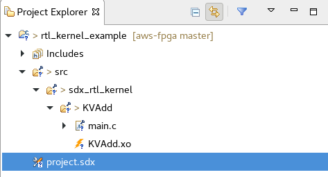
    </p>
    <p align = "center">
    <i>The rtl kernel related files added to the src folder</i>
    </p>  
1. Double-click on the **main.c** and look at its content  
The _main_ function is defined on line 60. The number of words it transfers is 4096. Lines 96 to 107 fills the source operands and expected result. Lines 200-244 deals with loading xclbin and creating kernel. Lines 248-266 creates the buffers in the device memory. Lines 319-333 sets arguments, executes the kernel, and waits for it to finish. Lines 346-385 reads the data and compares them. Lines 391-401 releases the memory, program, and kernel.

### Add binary container and kernel, select the Emulation-HW build configuration, and build the project
1. Select **project.sdx** in the _Project Explorer_ tab to see the project settings page
1. Click on the **Add Binary Container** button ()  
Notice the _binary\_container\_1_ is added to the project. Since the design has RTL IP, the binary container does not have further hierarchy
    <p align="center">
    
    </p>
    <p align = "center">
    <i>Adding binary container to the project</i>
    </p>  
1. Click on the **Add Hardware Function button** () and select _KVAdd_
1. Either select **Project &gt; Build Configurations &gt; Set Active &gt; Emulation-HW** or click on the drop-down button of _Active build configuration_ and select **Emulation-HW**
    <p align="center">
    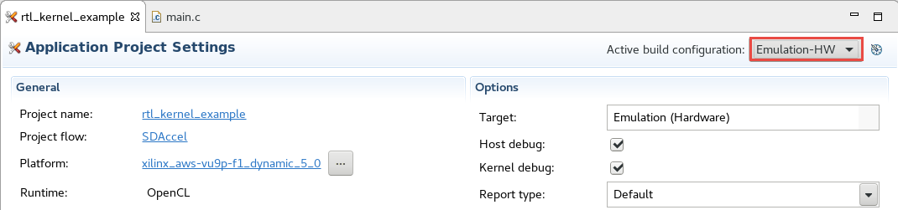
    </p>
    <p align = "center">
    <i>Selecting HW emulation build configuration</i>
    </p>  
1. Either select **Project &gt; Build Project** or click on the () button  
This will build the project including rtl\_kernel\_example.exe file under the Emulation-HW directory
1. Select **Run &gt; Run Configurations…** to open the configurations window
1. Click on the **Arguments** tab and notice that no binary container is assigned
    <p align="center">
    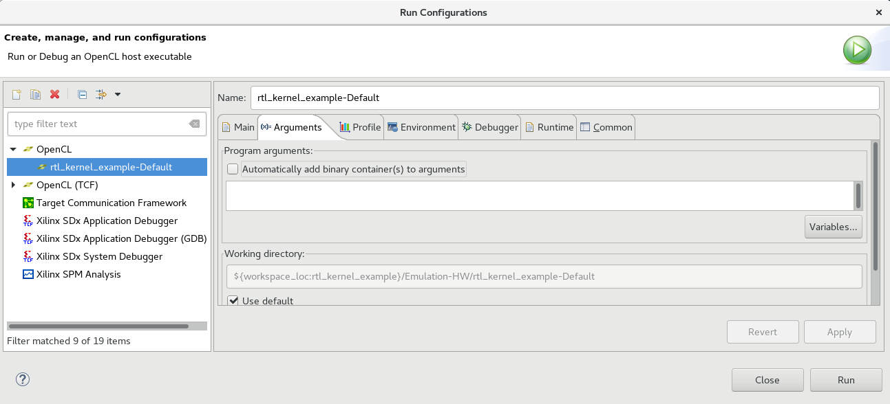
    </p>
    <p align = "center">
    <i>Unpopulated Arguments tab</i>
    </p>  
1. Click on the **Automatically add binary container(s) to arguments** check box
1. Click on the **Environment** tab, and change the _LD\_LIBRARY\_PATH_ variable setting to **/opt/xilinx/xrt/lib** and click **OK**
1. click **Apply**, and then click **Run** to run the application
    <p align="center">
    
    </p>
    <p align = "center">
    <i>Program argument assigned</i>
    </p>  
1. The Console tab shows that the test was completed successfully along with the data transfer rate
    <p align="center">
    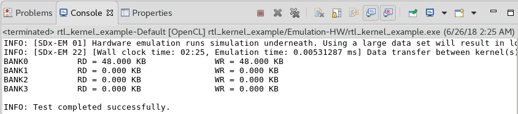
    </p>
    <p align = "center">
    <i>Hardware emulation run output</i>
    </p>  
1. In the **Assistant** tab, expand **Emulation-HW > rtl_kernel_example-Default**, and double-click on the **Application Timeline** entry, expand all entries in the timeline graph, zoom appropriately and observe the transactions
    <p align="center">
    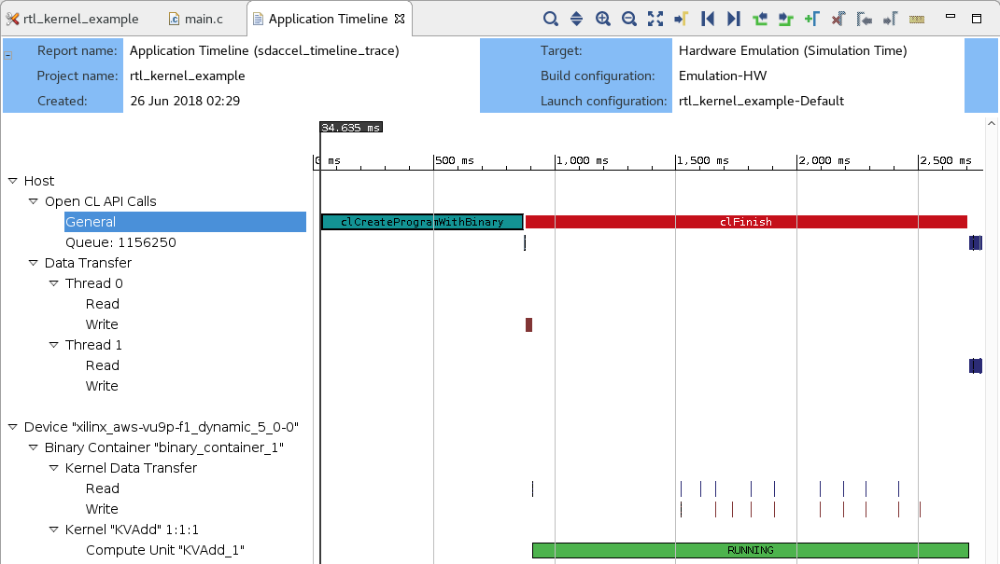
    </p>
    <p align = "center">
    <i>Timeline graph showing various activities in various region of the system</i>
    </p>  

###  Run the Application on F1        
**Since the System build and AFI availability takes considerable amount of time, a pre-compiled version is provided. Use the precompiled solution directory to verify the functionality**  

1. Change to the solution directory by executing the following command  
   ```
      cd /home/centos/sources/rtl_kernel_solution
   ```  
1. Run the following commands to load the AFI and execute the application to verify the functionality  
   ```
      sudo sh
      source /opt/xilinx/xrt/setup.sh
      ./rtl_kernel_example.exe xclbin/binary_container_1.awsxclbin
   ```
1. The FPGA bitstream will be downloaded and the host application will be executed showing output something like:
    <p align="center">
    
    </p>
    <p align = "center">
    <i>Execution output</i>
    </p>  

1. Enter **exit** in the terminal window to exit out of _sudo shell_  
1. Close the SDx by selecting **File &gt; Exit**

## Conclusion

In this lab, you used the RTL Kernel wizard to create a sample adder application. You saw that the wizard creates an RTL IP with the specified number of AXI master ports. You performed HW emulation and analyzed the application timeline. You finally ran the application on an AWS F1 instance and validated the functionality.

---------------------------------------

<p align="center"><b>
Start the next lab: <a href="debug_lab.md">6. Debug Lab</a>
</b></p>

---------------------------------------

## Appendix: Build Full Hardware 
**Set the build configuration to System and build the system (Note that since the building of the project takes over two hours skip this step in the workshop environment).**  

1. Either select **Project &gt; Build Configurations &gt; Set Active &gt; System** or click on the drop-down button of _Active build configuration_ and select **System**  
1. Set the XOCC Kernel Linker flag as done before
1. Either select **Project &gt; Build Project** or click on the () button    
This will build the project under the **System** directory. The built project will include **rtl\_kernel\_example.exe** file along with **binary\_container\_1.xclbin** file. This step takes about two hours  

**Once the full system is built, you can create an AFI by following the steps listed <a href="Creating_AFI.md">here</a>**

